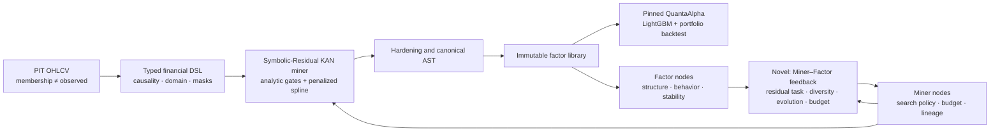
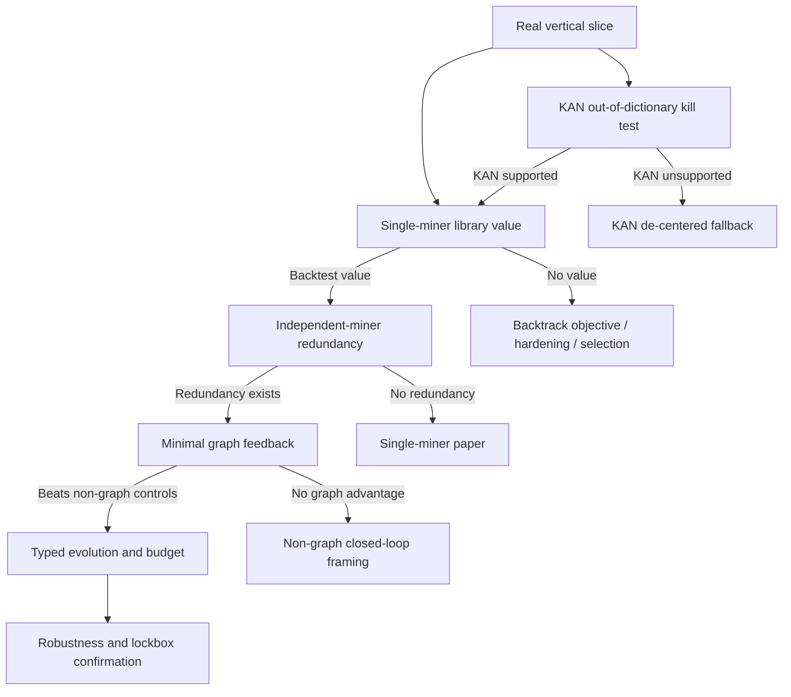

# MIRAGE-KAN Figure Sketches

## Method figure

Visual priority: gray out the standard PIT and Quanta blocks; use one color for the Symbolic-Residual miner and another for the feedback loop. The exported AST/library path must visibly bypass graph state at inference.

## Evidence dependency figure

## Teaser placeholder

Use a two-panel result figure only after evidence exists:

- Left: net Information Ratio with paired uncertainty for baseline, single miner, independent miners, and MIRAGE-KAN.
- Right: effective rank or unique valid AST yield at the same full-evaluation budget.

Do not draw expected bars or placeholder gains that could anchor later interpretation.

