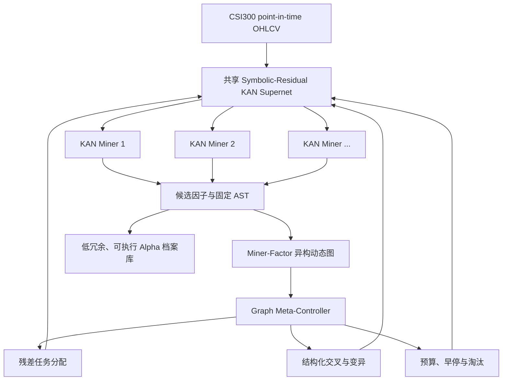

# KAN Alpha 因子挖掘框架：研究整理、系统方案与实施手册

> 面向 CSI300 日频横截面数据的可解释 Alpha 发现研究  
> 文档性质：对“KAN 框架优化与挑战”完整会话的结构化重写  
> 推荐主方案：**MIRAGE-KAN——图控制的符号—残差 KAN 矿机协同进化**  
> 适用读者：研究者、算法工程师、量化研究员，以及需要继续执行本项目的 AI agent  
> 本版修订（2026-07）：整合外部评审意见。主方案不变，新增：图必要性关键基线（14.2 节）、字典外原语恢复主实验（15.8 节）、LLM 公式挖掘路线定位（19.6 节）、四条新增风险（20.7—20.10 节）、降级路径与次级策略 Plan B/C/lite（第 21 节）

---

## 0. 这份文档解决什么问题

原始讨论围绕一个直觉展开：

> KAN 将可学习的一元函数放在网络边上，能够直接观察函数形状，因此可能比 MLP、遗传算法等方法更适合发现具有价格—成交量逻辑、可分析机制和可执行表达的 Alpha 因子。

初步实验随即暴露出四个关键问题：

1. B 样条能够画出曲线，却很难转换成金融研究中常用的标准算子公式；
2. 输入人工基础特征后，KAN 容易退化成“已有因子组合器”，而不是从原始数据发现新因子的矿机；
3. 浅层 KAN 难以处理长时序、多尺度和复杂变量交互；
4. 单一 KAN 计算慢、候选重复率高，而且无法主动处理因子多样性、过拟合与衰减。

经过三轮讨论，研究命题逐渐从“用一个 KAN 预测横截面分数”收敛为：

> **以类型化程序图约束因子结构，以 KAN 优化连续函数、阈值和窗口，以残差样条发现未知原语。**
>
> **再用 Miner–Factor 图把质量、多样性、稳定性和衰减信号反馈到下一轮矿机任务、结构、交叉、变异和预算中。**

这份文档不是简单拼接对话，而是将全部内容重新组织为：

- 一套统一的问题定义；
- 一组必须先澄清的概念；
- 四个完整系统方案；
- 一个最推荐的 AAAI 主方案；
- 一套适用于 CSI300 的实验协议；
- 一条可逐步实现、可做消融、可写论文的工程路线；
- 一份供后续 agent 直接接手的执行契约。

### 阅读方式

- 只想理解最终结论：阅读第 1、2、10、18 节。
- 想设计模型：阅读第 3—11 节。
- 想立即开始实现：阅读第 12—17 节。
- 想写 AAAI 论文：阅读第 10、14—16、19、21 节。
- 想评估风险与降级路径：阅读第 20—21 节。
- 想继续做文献核验：阅读附录 A。

### 目录

1. 一页式结论
2. 从第一性原理重新定义研究问题
3. 四个初始问题的统一解释
4. 统一底座：Typed Symbolic-Residual Temporal KAN
5. 公式、分数与损失
6. 深度与递归
7. 图网络的三个位置
8. 四套完整系统方案
9. 为什么推荐 MIRAGE-KAN
10. MIRAGE-KAN 完整设计
11. 多样性、过拟合与衰减
12. 挖掘效率
13. CSI300 数据与实验协议
14. 基线与消融
15. 评价指标
16. 因子机制卡与解释验证
17. 分阶段实施路线
18. 训练算法伪代码
19. AAAI 论文定位
20. 主要风险与失败判据
21. 降级路径与次级策略
22. 后续 agent 执行契约
23. 最终建议
24. 附录：文献导航、术语与最小实验矩阵

### 证据边界

本文首先是**会话内容的忠实整理与方案化重写**。本次扩写又独立核验了会直接影响方案判断的核心论文和官方代码，但没有逐篇复核会话中出现的每一项实验数字。因此：

- “系统应该如何设计”属于研究建议；
- 带可点击论文链接的文献判断已经在本次整理中重新核验摘要或官方说明；
- 只在附录列名、没有正文来源链接的论文，仍属于待核验线索；
- “该方案一定有效”不是已验证结论；
- 真正投稿前，必须重新核对论文原文、版本、代码和实验设置。

本文使用三种证据标签：

- **[已核验]**：本次读取了论文摘要、论文页面或官方代码说明；
- **[会话结论]**：来自原始长对话的综合判断，尚未由本项目实验验证；
- **[研究假设]**：需要通过新实验回答，不能写成既定事实。

---

## 1. 一页式结论

### 1.1 KAN 应该扮演什么角色

KAN 最合适的定位不是下面任意一个极端：

- 只输出横截面分数的灰盒预测器；
- 直接逐 token 输出公式字符串的生成器；
- 把所有 B 样条强行后验拟合成公式的符号化工具。

更合理的定位是：

> **KAN 是可微程序搜索器中的连续求解模块。**

它负责：

- 学习一元非线性形状；
- 选择解析原语；
- 优化阈值、缩放和连续参数；
- 对离散窗口和算子提供可微松弛；
- 以受惩罚的 B 样条残差补足符号字典；
- 发现反复出现、值得升级为新金融原语的函数形状。

### 1.2 模型最终应该输出什么

最终不是“公式”和“分数”二选一，而是同时输出：

\[
\mathcal O_f=
\left(
F_{\mathrm{AST}},
a_{i,t},
s_{i,t},
M_f,
\mathcal L_f
\right),
\]

其中：

- \(F_{\mathrm{AST}}\)：可执行公式或固定函数电路；
- \(a_{i,t}\)：公式执行后的原始因子值；
- \(s_{i,t}\)：显式 `CSRank` 或标准化后的横截面分数；
- \(M_f\)：复杂度、样条占比、窗口、风险暴露、稳定性、忠实度等元数据；
- \(\mathcal L_f\)：父代、交叉、变异和矿机来源等谱系信息。

公式是程序结构，分数是程序在数据上的执行结果，两者并不冲突。

### 1.3 B 样条是否应该删除

不应全部删除，也不应让它支配最终解释。

推荐采用：

\[
\phi_e(x)=
\sum_{k=1}^{K}\pi_{e,k}c_{e,k}f_k(a_{e,k}x+b_{e,k})
+\pi_{e,s}\epsilon_e s_e(x),
\]

即：

- 解析原语负责主要表达；
- B 样条作为受惩罚的探索残差；
- 训练后逐步硬化门控并尽量关闭样条；
- 无法关闭样条的候选必须被标记为半符号或纯神经因子。

这样保留有限样本下的局部表达能力，同时诚实区分“可执行公式”和“仍依赖自由函数”。

### 1.4 KAN 是否应该做深

必须区分三种深度：

1. 神经层数；
2. 时间感受野；
3. 公式 AST 深度。

它们不是同一件事。

建议第一版采用：

- 数值 KAN 深度：2—4 层；
- 每层设置独立因子出口；
- 公式 AST 最大深度：5—8；
- OHLCV 历史窗口：60 或 120 个交易日；
- 时序复杂度主要由显式 `Delay`、`Delta`、`TsMean`、`TsCorr` 等算子构造，而非让深 KAN 隐式模拟。

### 1.5 图网络应该放在哪里

图不应只在因子生成后做聚类和删重，否则它只改变“保留什么”，不改变“生成什么”。

图控制信号应该反馈到 KAN 矿机，改变：

- 残差预测任务；
- 算子和窗口先验；
- KAN 边增删；
- 多样性和稳定性损失权重；
- 交叉对象与变异类型；
- 训练预算、早停和淘汰概率。

但图的隐藏状态**不能进入最终因子的日常计算**。图负责挖掘阶段的搜索控制，最终因子仍是独立、固定、可审计的 OHLCV 程序。

### 1.6 最推荐的完整系统

首选：

> **MIRAGE-KAN: Miner–Factor Graph Co-Evolution for Interpretable Alpha Discovery**

最小闭环由四部分组成：

1. Typed Symbolic-Residual KAN 矿机；
2. Miner–Factor 异构动态图；
3. 图分配的残差任务与可微排斥损失；
4. 图控制的结构化交叉、变异和预算。

状态节点、生存模型、GFlowNet 和完整机制地图可以作为扩展，不应在首篇论文中一次堆满。

---

## 2. 从第一性原理重新定义研究问题

### 2.1 Alpha 因子不是普通回归中的“真实公式”

标准符号回归通常隐含一个目标：存在某个真实函数 \(y=f(x)\)，算法应恢复它。

Alpha 发现不同：

- 市场中不存在唯一“真实 Alpha 公式”；
- 收益标签低信噪比、非平稳且高度受选择偏差影响；
- 多个公式可能只在行为层面等价；
- 单个因子的最佳 IC 不等于加入因子池后的最大边际价值；
- 搜索越多，最优回测越可能是偶然结果。

因此，目标不应是“恢复一个真实公式”，而应是：

> 在固定数据访问、候选评价与计算预算下，发现一组可执行、低冗余、可审计、样本外稳定，并对已有因子池具有边际价值的价格—成交量程序。

### 2.2 三层解释性必须分开

#### 计算透明性

能否明确写出并执行：

```text
-CSRank(TsCorr(Delta(log(Close), 5), Delta(log1p(Volume), 5), 20))
```

#### 行为解释性

能否回答：

- 依赖哪个原始变量？
- 依赖哪个滞后和窗口？
- 是单调、阈值、饱和、U 形还是非对称？
- 删除某个变量或滞后后，因子是否按解释预期变化？
- 在哪些状态中有效或失效？

#### 经济机制解释

能否把公式组织为可检验陈述，例如：

> 中期价格上升只有在成交量同步扩张时更容易延续；量价背离可能对应趋势衰竭。

公式显式只保证第一层，不自动保证第二和第三层。

### 2.3 “经济学物理意义”的合理边界

若输入严格限制为 OHLCV，能够合理声称的是：

- 趋势延续或短期反转；
- 量价确认与背离；
- 波动聚集与价格区间效应；
- 阈值型流动性冲击代理；
- 上涨与下跌的非对称响应；
- 成交量饱和和极端交易行为。

不应轻易声称：

- 发现了结构性经济定律；
- 得到了价值、盈利、投资等基本面机制；
- 公式本身证明了因果关系。

更稳健的论文措辞是：

> **发现可审计的价格—成交量动态机制。**

### 2.4 原始对话中的决策演化

原始会话不是一次性提出 MIRAGE-KAN，而是经过三轮问题收敛。保留这条推理链很重要，因为它解释了每个模块为何存在。

#### 第一轮：从四个实验痛点推导“程序结构优先”

最初直觉是让 B 样条 KAN 直接从 OHLCV 中长出可解释 Alpha。实验却显示，曲线形状和标准金融算子之间存在表示错位。

由此得到第一个核心决策：

> KAN 的可视化只提供局部函数假设；真正的 Alpha 解释必须由类型化算子、时间窗口、变量来源和可执行结构共同承担。

这一轮提出了 Typed Operator Graph-KAN：OHLCV 叶节点、金融 DSL、Operator-KAN、候选因子图和透明组合器。

#### 第二轮：澄清 B 样条、输出形式和网络深度

第二轮问题集中在三个两难：

1. 删除 B 样条是否损失表达能力；
2. KAN 应输出公式还是横截面分数；
3. 更深或递归 KAN 是否更能形成复杂因子。

由此形成三个决策：

- 不删除 B 样条，而是把它降级为受惩罚残差；
- 训练期输出软程序执行值，导出时同时产生硬公式和分数；
- 复杂度主要放在显式 AST/DAG，不把单个标量分数反复喂给下一层 KAN。

这一步把 KAN 的角色从“预测网络”改成“可微程序中的连续求解器”。

#### 第三轮：澄清图是否真正作用于挖掘过程

第三轮提出最关键的反驳：若图只建立在因子库上，它与 KAN 矿机的交叉、变异和训练无关，无法从生成源头解决重复、过拟合和衰减。

因此最终决策是：

> 图不仅评价已经生成的因子，还要控制下一代矿机的残差任务、结构门控、交叉对象、变异操作和计算预算。

同时设置解释性红线：图只控制搜索过程，不能成为最终因子运行时的隐藏输入。

#### 三轮讨论压缩后的不可妥协项

| 项目 | 最终决策 | 若违反会发生什么 |
|---|---|---|
| 输入 | 叶节点只允许 point-in-time OHLCV | 退化为人工特征组合器 |
| 表达 | DSL 与 KAN 残差并存 | 纯样条难导出；纯 DSL 可能欠拟合 |
| 输出 | 公式、因子值、横截面分数和元数据同时输出 | 只输出分数则解释链不闭合 |
| 深度 | 浅中层 KAN + 较深显式程序 | 深潜在网络难归因 |
| 递归 | 传递中间公式集合，不传递单个分数 | 标量信息瓶颈和排序等价 |
| 图反馈 | 必须改变候选生成分布 | 只能事后删重，效率不改善 |
| 部署 | 最终因子独立于图 | 退化为动态图预测模型 |
| 统计 | 记录全部搜索试验 | 无法量化选择偏差 |

### 2.5 本研究真正需要回答的六个科学问题

#### RQ1：KAN 的独特价值是什么

在固定参数、FLOPs、数据访问和评价预算下，KAN 是否在以下任一维度稳定优于 MLP 或纯符号搜索：

- 函数结构恢复率；
- 软—硬公式忠实度；
- 新原语发现能力；
- 少样本参数效率；
- 可解释性—预测质量 Pareto 前沿。

#### RQ2：训练中符号化是否优于后验符号化

比较相同 KAN 骨架下：自由样条后验拟合、纯符号门控、符号—样条残差三种方式。

#### RQ3：公式复杂度应来自哪里

比较深 KAN、浅 KAN + 显式 AST、多出口 KAN-DAG，判断性能是否必须依赖难解释的潜在深度。

#### RQ4：图反馈是否真的改变生成分布

不能只看最终组合收益。必须观察唯一 AST 数、重复率、结构熵、有效秩和单位完整评估预算产出。

#### RQ5：闭环是否改善样本外稳定性

验证图控制是否提高验证到测试保持率、最差环境表现和因子生存时间，而不是只提高验证期 IC。

#### RQ6：所谓机制解释是否忠实

公式文字解释、函数形状、变量删除、滞后屏蔽和状态失效是否相互一致。

### 2.6 可证伪假设

| 编号 | 假设 | 支持证据 | 否证结果 |
|---:|---|---|---|
| H1 | 符号—残差 KAN 能形成更优表达力—解释性 Pareto | 相同 OOS 质量下公式更短、忠实度更高 | 纯符号或普通 KAN 全面占优 |
| H2 | 残差任务比统一标签更能产生互补因子 | 重复率下降、有效秩上升 | 只增加噪声，OOS 下降 |
| H3 | 图控制进化比随机进化更节省完整评价 | 单位预算接受因子更多 | 搜索成本更高且无质量增益 |
| H4 | 矿机谱系信号能预测候选寿命 | 衰减风险校准良好 | 与简单近期 IC 基线无差异 |
| H5 | KAN 的函数形状可形成可复用新原语 | 跨时间、种子和市场重复出现 | 形状不稳定、仅拟合噪声 |

这些假设必须在项目开始前写入实验注册文件，避免看到结果后更改成功标准。

---

## 3. 四个初始问题的统一解释

| 初始观察 | 根本原因 | 对应设计原则 |
|---|---|---|
| B 样条可视化但难写成公式 | 连续一元曲线空间与金融算子语法空间不一致 | 解析原语 + 显式金融 DSL + 残差样条 |
| 输入基础特征后变成组合器 | 特征构造与因子组合没有架构隔离 | 叶节点只允许 OHLCV，派生特征在程序内部生成 |
| 浅层 KAN 缺少时序能力 | 一元边函数不是时序记忆机制 | OHLCV 历史窗口 + 显式时序算子 + 多尺度窗口 |
| 单 KAN 慢且候选相似 | 所有矿机共享标签、目标和搜索空间，没有谱系记忆 | 异质矿机 + 图反馈 + 残差任务 + 结构化进化 |

这四个问题共同说明：

> 金融 Alpha 的解释性主要来自**受约束的程序结构、原始输入归因和稳定性验证**，而不是来自单条样条曲线本身。

### 3.1 关键文献证据如何约束本方案

#### KAN 的合理主张边界

原始 [KAN 论文](https://arxiv.org/abs/2404.19756) 将可学习一元函数放在边上，并以函数拟合、PDE 和科学发现案例展示精度与可视化能力。[已核验]

[KAN 2.0](https://arxiv.org/abs/2408.10205) 又加入乘法节点、公式编译器和树转换工具，说明科学发现需要显式乘法与模块结构，而不只是普通求和型 KAN。[已核验]

但 [KAN or MLP: A Fairer Comparison](https://arxiv.org/abs/2407.16674) 在控制参数量或 FLOPs 后报告：KAN 的稳定优势主要出现在符号公式表示，而一般 ML、视觉、语言和音频任务中 MLP 更强。[已核验]

该工作的消融还把部分符号优势归因于 B 样条本身。[已核验]

因此，本项目不能以“KAN 普遍预测更强”为动机。更可信的命题是：

> KAN 是否能在受约束函数发现、结构恢复和可审计局部非线性方面提供独特价值。

#### 为什么要训练中符号化

[S2KAN](https://arxiv.org/abs/2512.07875) 指出，标准 KAN 可能形成数值准确却没有符号忠实度的病态分解。[已核验]

它把符号原语、稠密项、可微门控和 MDL 目标放进训练；符号不足时可以退回稠密样条。[已核验]

2026 年的 [Symbolic-KAN](https://arxiv.org/abs/2603.23854) 进一步使用解析原语、层级门控与符号正则，使连续混合逐步收敛为单一原语选择，避免训练后逐边拟合。[已核验]

这两项工作直接支持“解析原语 + 残差样条 + 门控硬化”，但它们并没有解决金融时序 DSL、因子池多样性和矿机闭环控制。因此本项目必须在这些领域形成实质新增。

#### 为什么类型化程序是必要底座

[Alpha²](https://arxiv.org/abs/2406.16505) 把 Alpha 发现视为程序构造，并在生成前使用量纲分析检查逻辑有效性。[已核验]

[AlphaCFG](https://arxiv.org/abs/2601.22119) 使用面向 Alpha 的上下文无关语法、语法感知 MCTS 和结构敏感价值/策略网络，明确把语法合法、规模受控和金融解释纳入搜索空间。[已核验]

因此，“给 Alpha 搜索增加语法”本身不是新颖贡献。本文的类型系统必须进一步覆盖：

- 价格、成交量和无量纲序列；
- 时间可见性与标签边界；
- 截面算子和时序算子的轴语义；
- 数值定义域与可交易性掩码；
- KAN 连续函数对类型的保持或变换。

#### 为什么因子池目标比单因子 IC 更合理

[AlphaGen 官方实现](https://github.com/RL-MLDM/alphagen) 对应 KDD 2023 的协同公式因子集合工作，其核心不是只找一个最优公式，而是生成能在组合中协同工作的因子集合。[已核验]

[AlphaForge](https://arxiv.org/abs/2406.18394) 采用生成—预测与动态组合两阶段框架，强调低信噪比、因子多样性和动态权重。[已核验]

这意味着本项目的主要奖励应包含加入当前池后的边际价值，而非只奖励独立 IC。

#### 为什么图必须反馈生成器

[AlphaSAGE](https://arxiv.org/abs/2509.25055) 已使用 RGCN 编码公式结构、GFlowNet 生成多模态高奖励候选，并通过多维奖励处理稀疏反馈和模式坍缩。[已核验]

[AlphaPROBE](https://arxiv.org/abs/2602.11917) 已将因子和演化链接组织为 DAG，通过贝叶斯检索和祖先路径引导下一轮生成。[已核验]

[AlphaLogics](https://arxiv.org/abs/2603.20247) 则把“市场逻辑”作为独立对象，从历史因子提取逻辑，再用因子回测反向更新逻辑库。[已核验]

所以，仅仅“把因子建图”“用图检索父代”或“用逻辑指导公式”都不足以构成本项目的新颖性。

MIRAGE-KAN 必须证明：

> 因子和矿机图的消息能够改变 KAN 的训练任务、边函数、窗口、结构、交叉和预算，而且这种反馈在固定搜索预算下优于只做因子图后处理。

#### 为什么 GFlowNet 是备选而不是默认主线

[GFlowNet Foundations](https://arxiv.org/abs/2111.09266) 的目标是近似按奖励比例采样，从而保留多个高奖励模式，而不是像标准奖励最大化那样收敛到单一模式。[已核验]

这与 Alpha 多样性高度吻合。但 AlphaSAGE 已经把 GFlowNet 用到公式 Alpha，因此本项目只有在 KAN 连续孔洞优化或 Miner–Factor 闭环上产生新结果时，才值得引入 GFlowNet。

#### 为什么回测统计必须进入系统设计

[The Probability of Backtest Overfitting](https://papers.ssrn.com/sol3/papers.cfm?abstract_id=2326253) 提出 CSCV 与 PBO，用来估计从大量历史策略试验中挑选最佳者后发生样本外退化的概率。[已核验]

[The Deflated Sharpe Ratio](https://www.davidhbailey.com/dhbpapers/deflated-sharpe.pdf) 针对选择偏差、回测过拟合与非正态收益修正 Sharpe 证据。[已核验]

[Harvey、Liu 与 Zhu](https://www.nber.org/papers/w20592) 讨论了资产定价因子发现中的多重检验，说明常规 `t > 2` 在大规模因子搜索中并不足够。[已核验]

因此，MIRAGE-KAN 的搜索日志必须把每次尝试视为统计试验，而不是只保存最终候选。

### 3.2 现有工作与本项目的差异矩阵

| 方法 | 主要搜索对象 | 类型/语法 | 多样性 | 谱系/图 | 反馈神经矿机 | 连续函数发现 |
|---|---|---:|---:|---:|---:|---:|
| AlphaGen | 公式集合 | 有限算子 | 池级协同 | 否 | 否 | 否 |
| AlphaForge | 公式 + 动态组合 | 有限算子 | 是 | 否 | 否 | 否 |
| Alpha² | 程序 | 量纲检查 | 奖励包含多样性 | 否 | 否 | 否 |
| AlphaCFG | 语法树 | 强 | 间接 | 树搜索 | 否 | 否 |
| AlphaSAGE | 公式图 | 有限算子 | GFlowNet + 奖励 | AST 图 | 否 | 否 |
| AlphaPROBE | 因子演化 DAG | 既有生成器约束 | 检索避免冗余 | 强 | 否 | 否 |
| S2KAN | KAN 边函数 | 符号字典 | 非主要目标 | 网络结构 | 单模型门控 | 是 |
| Symbolic-KAN | 解析原语结构 | 强 | 非主要目标 | 层级结构 | 单模型门控 | 是 |
| **MIRAGE-KAN** | 矿机策略 + 因子程序 | 金融类型系统 | 任务、结构、行为、池级 | Miner–Factor 图 | **是** | **是** |

表中最后两列是本项目必须用实验证明的差异，不能只靠架构图宣称。

---

## 4. 统一底座：Typed Symbolic-Residual Temporal KAN

无论选择哪套上层系统，底层矿机都建议采用同一结构。

### 4.1 输入与叶节点

数据张量：

\[
X_{i,t}\in\mathbb R^{L\times5},
\]

其中 \(L\) 为历史窗口，五个通道为 O、H、L、C、V。

叶节点严格只有：

\[
\mathcal T=\{Open,High,Low,Close,Volume\}.
\]

复权、缺失、停牌和可交易性掩码属于数据一致性处理，不算人工 Alpha 特征。

### 4.2 金融类型系统

建议至少定义：

| 类型 | 例子 |
|---|---|
| `PriceTS` | Open、High、Low、Close |
| `VolumeTS` | Volume |
| `DimensionlessTS` | Return、价格比、相关系数 |
| `PriceDiffTS` | 价格差分 |
| `CrossSectionSignal` | CSRank、截面 ZScore |
| `WindowInt` | 2、3、5、10、20、40、60 |
| `TradabilityMask` | 当日是否可交易 |

类型签名示例：

\[
\operatorname{SafeDiv}:PriceTS\times PriceTS\to DimensionlessTS,
\]

\[
\operatorname{TsCorr}:TS\times TS\times WindowInt\to DimensionlessTS,
\]

\[
\operatorname{CSRank}:TS\to CrossSectionSignal.
\]

类型系统应在昂贵回测前拒绝：

- 对非法定义域直接取对数；
- 不同量纲变量无意义相加；
- 把窗口长度当成时间序列；
- 未来数据访问；
- 对常数做滚动相关；
- 无限制嵌套 Rank、Neutralize；
- 数值不稳定的除法或极端爆炸。

### 4.3 显式算子节点

以下关系不应由样条边“猜出来”，而应作为可审计节点：

- 一元：`Identity`、`Abs`、`Square`、`SignedLog1p`、`Tanh`、`Clip`、`Hinge`；
- 二元：`Add`、`Sub`、`Mul`、`SafeDiv`；
- 时序：`Delay`、`Delta`、`TsMean`、`TsStd`、`TsRank`、`TsCorr`、`TsCov`；
- 截面：`CSRank`、`CSZScore`，必要时加入可审计的中性化；
- 常数：阈值、缩放和少量可解释参数。

### 4.4 符号—样条混合边

每条 KAN 边采用：

\[
\phi_e(x)=
\sum_k \pi_{e,k}c_{e,k}f_k(a_{e,k}x+b_{e,k})
+\pi_{e,s}\epsilon_e s_e(x).
\]

设计含义：

- \(f_k\)：有限解析原语；
- \(\pi_{e,k}\)：Gumbel-Softmax、Hard-Concrete 或其他稀疏门控；
- \(s_e\)：B 样条残差；
- \(\epsilon_e\)：残差强度，受到显著惩罚。

训练前期允许样条探索，训练后期降低门控温度并增加：

\[
\mathcal L_{symbol}
=\lambda_HH(\pi)
+\lambda_0\|\pi\|_0
+\lambda_s\rho_{spline}
+\lambda_cC_{AST}.
\]

样条残差占比可定义为：

\[
\rho_{spline}
=\frac{\mathbb E[(\epsilon_es_e(x))^2]}
{\mathbb E[\phi_e(x)^2]+\varepsilon}.
\]

### 4.5 输出等级

必须诚实区分：

1. **严格公式因子**：所有自由样条关闭，只剩 DSL；
2. **近似公式因子**：样条残差低于预设阈值，硬公式忠实度高；
3. **半符号因子**：结构可读，但局部明显依赖样条；
4. **纯神经因子**：无法可靠离散化，只能作为预测上限或原语发现样本。

不同等级不应混在同一“解释性”指标里。

### 4.6 离散窗口

窗口集合：

\[
\mathcal W=\{2,3,5,10,20,40,60\}.
\]

训练期采用软选择：

\[
O(x)=\sum_{w\in\mathcal W}q_wO_w(x),
\qquad
q_w=\frac{\exp(\alpha_w/\tau)}{\sum_v\exp(\alpha_v/\tau)}.
\]

导出时硬化为整数窗口。若保留两种时间尺度，也应显式写成加权组合，而不是藏在潜在层中。

### 4.7 最后一层约束

若评价主要依赖 RankIC、Top-K 或分组收益，则任何严格单调变换都不改变排序：

\[
Rank(g(a_t))=Rank(a_t).
\]

因此：

- 最后一个可学习层只允许 identity 或 affine；
- `CSRank` 放在模型外部或作为显式 DSL 节点；
- 去重时把单调变换和正负号等价纳入规范化；
- 不允许最终自由样条制造“看起来不同、排序完全相同”的伪多样性。

### 4.8 DSL 的最小语法草案

下面给出第一版可实现语法。它不是最终标准，但足以约束 AST、类型检查和交叉变异。

```ebnf
Factor        ::= CSRank(DimensionlessTS)
                | CSZScore(DimensionlessTS)
                | DimensionlessTS

DimensionlessTS
              ::= Return(PriceTS, Window)
                | SafeDiv(PriceTS, PriceTS)
                | TsCorr(TS, TS, Window)
                | TsRank(TS, Window)
                | UnaryDimless(DimensionlessTS)
                | Add(DimensionlessTS, DimensionlessTS)
                | Sub(DimensionlessTS, DimensionlessTS)
                | Mul(DimensionlessTS, DimensionlessTS)

PriceTS       ::= Open | High | Low | Close
                | Delay(PriceTS, Window)
                | TsMean(PriceTS, Window)
                | Add(PriceTS, PriceDiffTS)

PriceDiffTS   ::= Sub(PriceTS, PriceTS)
                | Delta(PriceTS, Window)

VolumeTS      ::= Volume
                | Delay(VolumeTS, Window)
                | TsMean(VolumeTS, Window)

TS            ::= PriceTS | PriceDiffTS | VolumeTS | DimensionlessTS
Window        ::= 2 | 3 | 5 | 10 | 20 | 40 | 60
```

实现时不要只做语法类型，还要做轴类型：

- `TimeSeries[asset, time]`；
- `CrossSection[asset | time=t]`；
- `Scalar`；
- `WindowInt`；
- `Mask[asset, time]`。

这样才能阻止把截面 Rank 误用成滚动 Rank，或在单只股票内部误算截面相关。

### 4.9 算子契约

每个算子必须实现统一接口：

```text
name
arity
input_types
output_type
lookback
causal
commutative
domain_check
mask_rule
normalization_rule
cost_estimate
canonicalize(children, params)
execute(panel, cache)
```

示例：`TsCorr(x, y, 20)` 的契约应明确：

- 输入轴均为资产 × 时间；
- 输出与输入同轴；
- 最小历史长度为 20；
- 当前时点只能使用 `t-19:t`；
- 任一输入窗口方差接近零时返回缺失；
- 有效观测不足时返回缺失；
- `TsCorr(x,y,w)` 与 `TsCorr(y,x,w)` 规范为同一结构。

### 4.10 金融类型不等于物理单位

价格、成交量和无量纲返回率具有明显语义差异，但金融类型不能照搬物理量纲。

例如：

- `High - Low` 有价格单位；
- `(High - Low) / Close` 无量纲；
- `Price × Volume` 可以解释为成交额代理，但若没有明确原语名，普通乘法可能难以解释；
- `log(Price)` 对换币种或价格缩放并不天然稳定，更推荐 `log(Price/Delay(Price,w))`。

因此类型系统需要同时检查：

1. 计算是否合法；
2. 是否对价格尺度变化稳定；
3. 是否有明确金融语义；
4. 是否值得进入首版搜索空间。

首版可以宁可保守，后续再通过样条形状与人工审核扩充原语。

### 4.11 原语库治理

原语库不能无限扩张。每个新原语必须通过以下门槛：

1. 在多个独立候选中反复出现相似样条形状；
2. 跨随机种子和滚动时间窗保持；
3. 可用低复杂度解析或分段函数近似；
4. 加入原语库后减少样条依赖或搜索成本；
5. 不只是已有原语的单调重参数化；
6. 有清晰定义域、边界行为和数值实现。

建议维护版本化清单：

```yaml
primitive_id: signed_saturation_v1
formula: sign(x) * (1 - exp(-abs(x) / c))
input_type: DimensionlessTS
output_type: DimensionlessTS
parameters: [c]
origin_factor_ids: [f_102, f_318, f_774]
stability_windows: 7/10
review_status: accepted
```

### 4.12 软节点、硬节点与离散化误差

一个软节点可能同时混合多个算子：

\[
h_v^{soft}=\sum_{k}p_{v,k}O_k(h_{p_1},h_{p_2};w_v).
\]

硬化后只保留：

\[
h_v^{hard}=O_{k^*}(h_{p_1^*},h_{p_2^*};w^*).
\]

如果软模型依靠多个算子的抵消或叠加，直接 argmax 会产生严重离散化误差。

因此需要四阶段硬化：

1. 温度退火并增加门控熵惩罚；
2. 逐节点锁定高置信选择；
3. 固定结构后重新拟合连续参数；
4. 若忠实度不足，回退到双原语节点或标记为半符号。

不要为了“公式看起来干净”而隐藏明显的软—硬性能损失。

---

## 5. 公式、分数与损失：不要混为一谈

### 5.1 公式与分数的关系

公式执行：

\[
a_{i,t}=F_{AST}(X_{i,t-L+1:t}).
\]

横截面转换：

\[
s_{i,t}=CSRank(a_{\cdot,t})_i.
\]

公式负责定义因子，分数负责进入预测或组合评价。

### 5.2 预测损失

未来 \(h\) 日收益标签：

\[
y_{i,t}^{(h)}=r_{i,t\to t+h}.
\]

基础损失可以使用每日横截面相关：

\[
\mathcal L_{IC}
=-\frac{1}{T}\sum_t Corr_{cs}(a_t,y_t^{(h)}).
\]

可选配对排序损失：

\[
\mathcal L_{pair}
=\frac{1}{T}\sum_t\sum_{i,j}
\log\left(1+\exp\left[-(a_{i,t}-a_{j,t})
sign(y_{i,t}-y_{j,t})\right]\right).
\]

### 5.3 回测效用不是标签损失的同义词

组合收益：

\[
r^p_{t+1}=w_t^\top y_{t+1}-c\|w_t-w_{t-1}\|_1.
\]

它是时间标量，横截面标签是股票向量，二者维度和含义不同。

如果直接把净 Sharpe 作为唯一训练目标，模型会把以下设计混在一起：

- 因子预测能力；
- 权重函数；
- Top-K 或 softmax 温度；
- 换仓规则；
- 成本假设；
- 持有期。

最终得到的是“特定策略程序”，不再是可迁移的独立 Alpha。

### 5.4 推荐双层优化

内层在训练窗口拟合矿机参数：

\[
\theta^*(\alpha)=\arg\min_\theta
\mathcal L_{train}(F_{\alpha,\theta}).
\]

外层在紧随其后的验证窗口选择结构与矿机策略：

\[
\alpha^*=\arg\max_\alpha
R_{val}(F_{\alpha,\theta^*(\alpha)}).
\]

外层奖励可包含：

\[
R_{val}
=ICIR
+\eta\Delta U(f\mid\mathcal P)
-\lambda_TTurnover
-\lambda_CComplexity
-\lambda_RRedundancy
-\lambda_DDecayRisk.
\]

其中 \(\Delta U(f\mid\mathcal P)\) 是加入当前因子池后的边际价值。

### 5.5 横截面 IC 的实现细节

每日 IC 不应直接对原始全体样本计算。每个交易日应执行：

1. 应用当日 point-in-time 成分与可交易掩码；
2. 去除因子或标签缺失；
3. 对因子值做预先冻结的 winsorize/标准化规则；
4. 对收益标签使用一致的异常处理；
5. 计算 Pearson IC 与 Spearman RankIC；
6. 保存当日有效股票数和覆盖率。

聚合时至少报告：

\[
\overline{IC}=\frac1T\sum_t IC_t,
\qquad
ICIR=\frac{\overline{IC}}{Std(IC_t)}\sqrt{A},
\]

其中年化因子 \(A\) 必须根据标签频率和重叠程度说明，不能机械使用 252。

### 5.6 重叠标签的依赖问题

未来 5 日和 20 日收益会导致相邻日期标签重叠，IC 时间序列也会自相关。

因此：

- 均值显著性需要 HAC/Newey–West 或块 bootstrap；
- 时间切分边界需要 purge；
- embargo 长度至少覆盖标签跨度或根据数据依赖设置；
- 训练批次不能把相邻重叠标签当作独立样本估计置信度。

### 5.7 多任务标签的作用

同时学习 5 日和 20 日标签不是为了简单提高平均 IC，而是为了区分：

- 短期反转与交易冲击；
- 中期趋势与量价确认；
- 不同换手和成本容忍度；
- 同一公式在不同持有期的衰减形状。

可采用共享骨架、独立出口：

\[
\mathcal L_{multi}=\omega_5\mathcal L_{IC}^{(5)}
+\omega_{20}\mathcal L_{IC}^{(20)}.
\]

若两个任务梯度冲突明显，应记录梯度余弦相似度，并考虑按矿机分工，而不是强制一个公式同时最优。

### 5.8 因子池边际价值的可操作定义

设当前池因子矩阵为 \(A_t\)，候选为 \(f_t\)。至少实现三种 \(\Delta U\)：

#### 预测增益

比较带约束 Ridge 在验证集上的损失：

\[
\Delta U_{pred}=L(A)-L([A,f]).
\]

#### 风险调整收益增益

固定组合器与成本模型，比较净 Sharpe 或效用：

\[
\Delta U_{port}=U([A,f])-U(A).
\]

#### 几何增益

比较因子矩阵有效秩或 log-det：

\[
\Delta U_{geom}=\log\det(K_{A\cup f}+\epsilon I)
-\log\det(K_A+\epsilon I).
\]

三者应分别报告，避免一个复杂组合器掩盖候选本身是否提供新信息。

---

## 6. 深度与递归：正确传递中间公式，而不是标量分数

### 6.1 为什么输入单日 OHLCV 不够

如果输入只有当天五个数字：

\[
x_{i,t}=(O,H,L,C,V)_{i,t},
\]

无论 KAN 多深，都无法真正计算 5 日收益、20 日均值、滚动相关和历史波动，因为历史信息根本没有进入模型。

“叶节点只使用原始 OHLCV”并不等于“只能使用当天 OHLCV”。正确做法是给模型 OHLCV 历史窗口，或者让时序算子访问历史序列。

### 6.2 一层 KAN 的能力与限制

一层标量 KAN 大致为：

\[
a=\phi_O(O)+\phi_H(H)+\phi_L(L)+\phi_C(C)+\phi_V(V).
\]

它不仅能表达 `log(Close)`，也能表达加性组合，例如 `log(C)-log(O)` 和 `H-L`。

但它难以自然表达：

- 价格变化与成交量冲击的乘法；
- 滚动相关；
- 条件阈值交互；
- 多尺度嵌套时序结构。

### 6.3 为什么不能把单个分数递归喂给下一层 KAN

若：

\[
a^{(1)}=F_1(X),\qquad a^{(2)}=F_2(a^{(1)}),
\]

第二层只能重标定第一层已经压缩成一个数的结果，无法恢复丢失的 OHLCV 信息。若 \(F_2\) 单调，横截面排序甚至完全不变。

不推荐：

```text
OHLCV → 单个 KAN 分数 → 单个 KAN 分数 → 单个 KAN 分数
```

### 6.4 正确递归：中间公式向量与表达式 DAG

令：

\[
H^{(0)}=\{O,H,L,C,V\},
\]

\[
H^{(d+1)}=H^{(d)}\cup
\{O_v(h_{p_1},h_{p_2};w_v)\}_{v=1}^{K_d}.
\]

每个中间节点都保留：

- 父节点；
- 算子；
- 类型；
- 窗口；
- 可执行 AST；
- 来源矿机与谱系。

原始 OHLCV 始终通过 skip connection 可访问。

示例：

```text
Depth 0: Close, Volume
Depth 1: SignedLog(Close), SignedLog1p(Volume)
Depth 2: Delta(log_price, 5), Delta(log_volume, 5)
Depth 3: TsCorr(price_change, volume_change, 20)
Depth 4: -CSRank(correlation)
```

这种深度是可读的“程序深度”，比不可归因的潜在层更符合 Formulaic Alpha 目标。

### 6.5 多出口

每个深度都产生候选：

\[
\mathcal L_{exit}=\sum_{d=1}^{D}\omega_d
\mathcal L_{IC}(a^{(d)},y).
\]

选择性能接近最优的最浅出口：

\[
d^*=\min\{d:R_d\ge R_{max}-\delta\}.
\]

这既能控制复杂度，也可同时产出不同程序深度的因子。

### 6.6 一个具体公式如何由 DAG 产生

以量价确认为例，目标公式为：

\[
f=-CSRank(TsCorr(Return(C,5),Delta(log1p(V),5),20)).
\]

构造过程：

| 深度 | 节点 | 类型 | 需要历史 |
|---:|---|---|---:|
| 0 | `Close` | PriceTS | 1 |
| 0 | `Volume` | VolumeTS | 1 |
| 1 | `Return(Close,5)` | DimensionlessTS | 6 |
| 1 | `SignedLog1p(Volume)` | DimensionlessTS | 1 |
| 2 | `Delta(log_volume,5)` | DimensionlessTS | 6 |
| 3 | `TsCorr(return_5, volume_delta_5,20)` | DimensionlessTS | 25 |
| 4 | `Neg` + `CSRank` | CrossSectionSignal | 25 |

这个例子说明：程序深度、算子 lookback 和输入窗口长度必须分别跟踪。AST 深度为 4，不代表只需要 4 天历史。

### 6.7 为什么普通深 KAN 难以映射到该公式

普通深 KAN 可以数值逼近上述关系，但其潜在节点通常是若干一元函数求和再复合。

即使最终预测一致，也无法自然回答：

- 哪个节点对应 5 日收益；
- 哪个节点对应成交量差分；
- 哪个层实现 20 日相关；
- 相关关系是否只是潜在函数偶然近似。

所以普通深 KAN 应作为预测上限基线，不是默认可解释实现。

---

## 7. 图网络的三个位置：不要混淆

| 图类型 | 节点 | 作用 | 是否适合主线 |
|---|---|---|---|
| 表达式图 | 中间公式与算子 | 构造复杂公式 | 是 |
| 因子谱系图 | 已导出的候选因子 | 去重、检索、边际价值与谱系学习 | 是 |
| 股票关系图 | 股票、行业或供应链 | 捕捉横截面关系 | 非首选；会改变纯 OHLCV 因子定义 |

本研究最需要前两种图。

### 7.1 为什么“只建因子库图”不够

如果图只在因子产生后打分，它只能改变：

\[
p(\text{保留}\mid f,\mathcal F),
\]

却无法改变矿机生成分布：

\[
f\sim p_{\theta_i}(f).
\]

相似因子仍然被重复训练、执行和回测，只是在最后删除。因此它改善因子库，不改善搜索过程。

### 7.2 真正闭环的图控制

图控制器应产生：

\[
c_i^{(g)}=G_\psi(\mathcal G^{(g)},i),
\]

并令下一代矿机服从：

\[
f_i^{(g+1)}\sim p_{\theta_i}(f\mid c_i^{(g)}).
\]

控制向量至少包括：

\[
c_i=
[\Delta\pi_i^{op},\Delta\pi_i^{win},
\Delta m_i^{edge},\lambda_i^{div},\lambda_i^{rob},
P_i^{mate},P_i^{mutation},B_i].
\]

### 7.3 解释性红线

图控制信号只用于“怎么挖”。最终公式部署时不能依赖图的隐藏向量：

```text
允许：图决定矿机任务、结构、变异和预算
禁止：最终因子每天必须读取全图隐状态才能计算
```

否则系统会退化为 Graph-MoE 预测器，而非独立 Alpha 发现框架。

---

## 8. 四套完整系统方案

### 8.1 总览

| 方案 | 核心方法贡献 | 最主要解决 | AAAI 适配度 | 工程风险 |
|---|---|---|---:|---:|
| **MIRAGE-KAN** | Miner–Factor 图控制的 KAN 种群协同进化 | 多样性、过拟合、衰减的统一闭环 | 最高 | 高 |
| **AtlasKAN** | Quality-Diversity 机制地图 | 多样性与机制解释 | 很高 | 中高 |
| **LIFE-KAN** | 因子生命周期与概念漂移控制 | 因子衰减 | 很高 | 中高 |
| **FlowKAN-DAG** | GFlowNet 离散骨架 + KAN 连续孔洞优化 | 搜索效率与公式输出 | 中高 | 中 |

### 8.2 方案一：MIRAGE-KAN

核心思想：把矿机、因子和可选的市场状态放进异构动态图，图控制器直接改变下一代 KAN 的任务与搜索策略。

适合的论文问题：

> 在非平稳、低信噪比环境中，如何让多个可解释神经程序矿机通过图反馈协同发现互补、稳定且低冗余的程序？

优点：最符合“图从 KAN 上层改变候选生成分布”的原始直觉。

风险：系统复杂，必须通过分层消融证明每条反馈路径都有效。

### 8.3 方案二：AtlasKAN

核心思想：不只追求最高 IC，而是把每个矿机分配到某个机制行为区域，形成 Quality-Diversity 档案库。

行为描述符可包含：

\[
b(f)=[变量,滞后,形状,换手,状态,暴露].
\]

机制单元示例：

- 短期价格反转；
- 中期量价确认；
- 高波动阈值响应；
- 低成交量流动性冲击；
- 非对称上涨/下跌响应。

优点：非常适合论证“KAN 发现函数机制”的独特价值。

风险：真实市场没有机制真值。必须补充带已知生成机制的合成横截面基准，否则解释评价容易显得主观。

### 8.4 方案三：LIFE-KAN

核心思想：将因子视为有生命周期的对象，建立 Factor–Regime 图，预测因子的生存概率或危险率，并反馈到矿机更新、休眠、重启和变异。

适合解决：

- 某因子是否整体失效；
- 是否只在某种市场状态有效；
- 是参数漂移，还是机制漂移；
- 哪类矿机长期产生短寿命因子。

风险：状态编码器可能成为真正的性能来源。必须比较 KAN/MLP、固定状态/动态状态、只识别状态/状态反馈矿机等设置。

### 8.5 方案四：FlowKAN-DAG

核心思想：GFlowNet 或其他离散搜索器生成类型化 AST 骨架，KAN 优化其中的一元函数、阈值、缩放和软窗口。

分工清晰：

```text
GFlowNet / MCTS / GP：选择公式骨架
Typed AST：保证类型、因果和数值合法
KAN：优化连续孔洞并发现未知一元形状
硬化器：导出固定公式
```

风险：与既有公式 Alpha 搜索工作接近。只有在以下至少一点成立时才足以成为主方案：

1. KAN 连续优化显著减少完整公式评估次数；
2. KAN 发现并稳定复现了原算子库中不存在的新一元原语。

否则它更适合作为 MIRAGE-KAN 的子模块或强基线。

---

## 9. 为什么推荐 MIRAGE-KAN

MIRAGE-KAN 同时满足四个要求：

1. KAN 仍然是方法不可缺失的组成部分，而不是名字装饰；
2. 图信号真正反馈到矿机，改变候选分布；
3. 最终因子独立于图运行，保留可解释性；
4. 多样性、过拟合与衰减被统一为因子池级外层学习目标。

推荐排序：

\[
MIRAGE\text{-}KAN
>AtlasKAN
>LIFE\text{-}KAN
>FlowKAN\text{-}DAG.
\]

首篇论文不应把四套系统全部实现成一个巨型架构。更现实的范围是：

> **MIRAGE-KAN 核心闭环 + Atlas 式描述符作为轻量多样性分析 + 生命周期指标作为评价，不在主模型中加入完整状态图。**

主方案的坚持条件、工程降级配置与可发表的备选出路，统一见第 21 节。原则是：**第一目标始终是完整 MIRAGE-KAN 闭环，但每个关键 Gate 都必须预先绑定一条降级路径，避免研究命题"全有或全无"。**

---

## 10. MIRAGE-KAN 完整设计

### 10.1 系统图



### 10.2 图定义

首版采用：

\[
\mathcal G^{(g)}=(V_M\cup V_F,E_{MF}\cup E_{FF}\cup E_{MM}).
\]

可选扩展再加入市场状态节点 \(V_R\)。

#### 矿机节点 \(V_M\)

每个节点是一套搜索策略或 KAN 子网络，而非一个最终因子。

节点特征：

- KAN 层数、宽度、边掩码；
- 解析原语与样条使用比例；
- 窗口门控分布；
- 最近生成因子的质量和重复率；
- 验证到测试的保留率或历史衰减；
- 梯度范数、稳定性、计算成本；
- 年龄、预算、成功率和被淘汰次数。

#### 因子节点 \(V_F\)

节点特征：

- AST/函数电路嵌入；
- 算子直方图和窗口分布；
- RankIC、ICIR 与滚动 IC；
- 换手、覆盖率、复杂度；
- 因子值、PnL 和 IC 轨迹相关；
- 样条残差比例和符号忠实度；
- 变量、滞后和函数形状签名；
- 来源矿机、父代与变异路径。

#### 边关系

至少包括：

- `produce`：矿机产生因子；
- `lineage`：因子父子或变异谱系；
- `structural`：AST 相似；
- `signal`：因子值相关；
- `pnl`：多空收益相关；
- `ic_path`：滚动 IC 轨迹相似；
- `crossover`：曾发生交叉；
- `miner_similarity`：矿机策略相似。

相关去重应使用绝对值，因为 \(f\) 与 \(-f\) 在信息结构上属于同一候选。

### 10.3 反馈路径一：残差任务分配

如果所有矿机都预测同一个收益标签，它们趋同是自然结果。

图控制器为矿机 \(i\) 选择一个邻域因子子集 \(\mathcal N_i\)，构造横截面残差标签：

\[
y_{i,t}^{res}=y_t-A_{\mathcal N_i,t}\hat\beta_i.
\]

矿机优化：

\[
\mathcal L_i^{pred}
=-\frac1T\sum_t Corr_{cs}(F_i(X_t),y_{i,t}^{res}).
\]

含义：每个矿机学习因子池尚未解释的不同方向。

关键边界：残差只作为训练标签，最终公式仍只依赖 OHLCV，所以它不是已有因子的组合器。

### 10.4 反馈路径二：可微多样性排斥

\[
\mathcal L_i^{div}
=\sum_{j\in\mathcal N_i^-}w_{ij}
\left[
\rho_s(a_i,a_j)^2
+\gamma\rho(PnL_i,PnL_j)^2
+\eta Sim_{AST}(i,j)
\right].
\]

其中 \(w_{ij}\) 由图控制器产生。

由于因子值对 KAN 参数可微，排斥信号直接改变边函数，而不是等生成后再删重。

### 10.5 反馈路径三：结构化交叉和变异

不能随意交换两个 KAN 的完整参数张量，因为隐藏节点通常没有天然对齐。

将矿机表示为类型化基因：

\[
g_i=(A_i,m_i,\pi_i^{op},\pi_i^{win},
\theta_i^{sym},\theta_i^{spline}).
\]

合法变异包括：

- 替换时间窗口；
- 替换一元原语；
- 增删类型兼容的边；
- 增加或删除乘法节点；
- 将局部样条硬化为解析函数；
- 交换类型兼容的 AST 子树；
- 添加或删除一层；
- 重置矿机私有适配器。

图学习：

\[
P(p,q,o\mid\mathcal G),
\]

其中 \(p,q\) 是父矿机或父因子，\(o\) 是操作类型。

### 10.6 反馈路径四：预算、早停与淘汰

\[
B_i=B_{min}+(B_{max}-B_{min})\sigma(h_i).
\]

资源分配原则：

- 高重复、低新颖、长期无效：降低预算；
- 图中稀疏、高不确定、潜在边际价值高：增加预算；
- 训练不稳定或数值频繁非法：提前终止；
- 长期只产生短寿命因子：修改算子先验或淘汰。

### 10.7 内层损失

\[
\mathcal L_i=
\mathcal L_i^{pred}
+\lambda_i^{div}\mathcal L_i^{div}
+\lambda_i^{rob}\mathcal L_i^{rob}
+\lambda^{MDL}\mathcal L_i^{MDL}
+\lambda^{spline}\rho_i^{spline}
+\lambda^HH(\pi_i).
\]

稳定性项可采用多历史环境：

\[
\mathcal L_i^{rob}
=-\overline{IC}_{i,e}
+\alpha Std_e(IC_{i,e})
+\beta CVaR_\tau(-IC_{i,e}).
\]

### 10.8 外层因子池奖励

\[
R^{pool}
=LCB(ICIR_{\mathcal F})
+\gamma\log\det(K_{\mathcal F}+\epsilon I)
-\lambda_TTurnover
-\lambda_CComplexity
-\lambda_DDecayRisk.
\]

含义：

- `LCB`：奖励统计下置信界，而非单点最好结果；
- `log-det`：奖励集合有效秩，避免因子挤在同一低维子空间；
- `Turnover`：控制实际执行成本；
- `Complexity`：控制公式长度和自由度；
- `DecayRisk`：惩罚性能趋势快速恶化的候选或矿机谱系。

注意：`LCB` 的置信区间估计口径必须与 5.6 节一致。IC 序列存在自相关，朴素标准误会显著低估不确定性、使 LCB 虚高，应统一使用 HAC/Newey–West 或块 bootstrap。

离散交叉、变异与预算动作可使用策略梯度；连续门控可使用 Gumbel-Softmax 或直通估计。

### 10.9 矿机不是一个完整独立模型，而是一套搜索策略

为了提高效率，矿机最好是共享 supernet 上的轻量个体。一个矿机状态可以表示为：

```yaml
miner_id: m_007
generation: 14
edge_mask: ...
operator_prior:
  TsCorr: 0.22
  Delta: 0.18
  TsRank: 0.07
window_prior:
  5: 0.31
  20: 0.28
max_ast_depth: 6
spline_budget: 0.15
target_horizon: 20
residual_task_id: r_031
private_adapter_id: a_007
remaining_full_evals: 12
```

这样“矿机交叉”主要作用于掩码、先验、子树和适配器，不需要复制完整 KAN 参数。

### 10.10 残差标签的三个版本

#### 全池线性残差

\[
y^{res}=y-A\hat\beta.
\]

优点是直接；缺点是因子池较大时不稳定，且可能把信号全部解释掉。

#### 邻域残差

图只选择与矿机当前产出最相关的一小组因子：

\[
y_i^{res}=y-A_{\mathcal N_i}\hat\beta_i.
\]

这是推荐首版。邻域大小可以固定为 4—16，并对 \(\hat\beta\) 使用 Ridge。

#### 正交子空间任务

对现有因子矩阵做稳定低秩分解，矿机被分配到尚未覆盖的残差主方向。

该版本更几何化，但解释性较弱，适合作为扩展消融。

### 10.11 防止残差任务退化

残差任务可能把标签变得更噪。至少加入：

- 原始标签与残差标签的混合：`y_mix = α y + (1-α) y_res`；
- 残差方差下限；
- 邻域条件数检查；
- 只在训练窗拟合残差回归；
- 每代重新估计但不使用未来验证信息；
- 若残差任务的可预测性低于门槛，矿机转向结构稀疏区探索。

### 10.12 图消息与矿机参数的接口

不要让 HGNN 直接输出数百万个 KAN 参数。推荐分层接口：

1. 图输出低维控制向量 \(c_i\)；
2. 超网络将 \(c_i\) 转成算子/窗口 logit 偏置；
3. 结构动作头输出离散变异分布；
4. 预算头输出训练步数和完整评估额度；
5. 私有适配器吸收矿机的局部连续差异。

可写为：

\[
\tilde\alpha_i^{op}=\alpha_i^{op}+H_{op}(c_i),
\qquad
\tilde\alpha_i^{win}=\alpha_i^{win}+H_{win}(c_i).
\]

这比图直接重建 KAN 权重更稳定，也更容易消融。

### 10.13 图控制器的训练信号归因

一个外层池级奖励会同时受多个矿机影响，信用分配困难。

可以逐步采用：

1. 先使用矿机局部奖励：候选质量、新颖性、忠实度；
2. 再加入加入池前后的差分奖励；
3. 最后再尝试长程代际奖励。

矿机 \(i\) 的差分奖励：

\[
D_i=R(\mathcal F)-R(\mathcal F\setminus\mathcal F_i),
\]

其中 \(\mathcal F_i\) 是该矿机本代被接受的候选。

该计算昂贵，可由代理模型近似，但必须用部分精确评估校准。

### 10.14 接受、归档与淘汰规则

候选进入正式档案库前，依次通过：

1. 类型、因果和数值安全；
2. 规范哈希去重；
3. 最低覆盖率；
4. 快速验证 IC 门槛；
5. 与现有池的多视图新颖性；
6. 软—硬忠实度；
7. 完整验证和成本评价；
8. 稳定性下置信界。

未通过的候选也不能直接丢弃。至少保留：

- 失败原因；
- 生成矿机；
- 结构哈希；
- 已消耗预算；
- 是否可作为负样本训练图 Critic。

### 10.15 动态图的时间因果性

在第 \(g\) 代训练矿机时，图只能包含在该代可见验证边界之前产生的统计。

禁止：

- 用最终测试期表现更新历史图节点；
- 用后续生命周期标签训练同一滚动窗控制器；
- 用全样本相关性建立图边；
- 在回放旧代时混入未来因子。

建议每个节点和边都带 `as_of_date`，图查询必须声明时间截面。

---

## 11. 三大难题如何在同一闭环中处理

### 11.1 多样性

不要只使用单一的因子值相关性。

多样性来自五个层次：

1. **任务差异**：图分配不同残差标签；
2. **结构差异**：AST、算子和窗口分布不同；
3. **行为差异**：因子值、PnL、持仓和滚动 IC 不同；
4. **风险差异**：规模、行业、Beta、波动等暴露不同；
5. **谱系差异**：减少沿同一父代反复局部搜索。

核心指标：

- 因子值绝对 Spearman 相关；
- PnL 绝对相关；
- 滚动 IC 轨迹相关；
- AST 子树相似；
- 因子矩阵有效秩；
- log-det；
- 机制区域覆盖率；
- 每一万候选中的唯一规范 AST 数。

### 11.2 过拟合

必须区分：

#### 参数过拟合

用稀疏门控、MDL、样条惩罚、早停和多环境稳定性处理。

#### 搜索过拟合

用嵌套滚动验证、历史伪未来外层选择、固定搜索预算和最终测试集一次性开启处理。

#### 多重检验/赢家选择偏差

用完整试验日志、候选总数、PBO、Deflated Sharpe、标签置换和多种子稳定性处理。

图网络只能改善候选分布，不能让多重检验问题消失。

### 11.3 因子衰减

图中保存滚动 IC 轨迹，预测衰减或生存风险：

\[
h_{f,e}=P(IC_{f,e+1}<\tau\mid\mathcal H_{f,e}).
\]

处理方式：

- 若只在特定状态有效，将其标记为状态特定因子；
- 若沿某个稳定谱系产生，优先从稳定祖先变异；
- 若矿机长期产生短寿命候选，降低预算或改变原语、窗口先验；
- 评价时报告 6、12、24 个月性能保持，而非只看全样本均值。

系统不能保证因子永不衰减，但可以把衰减变成训练和生命周期管理对象。

---

## 12. 挖掘效率：优先优化完整搜索管线

大规模 Alpha 发现中，主要开销通常不是图网络，而是候选在历史面板上的执行、截面处理和回测。

### 12.1 共享 KAN Supernet

所有矿机共享：

- 解析原语字典；
- B 样条节点和基函数；
- 大部分边参数；
- AST 编码器；
- 时序算子缓存；
- 图 Critic。

每个矿机只维护：

- 边掩码；
- 原语和窗口门控；
- 小型私有适配器；
- 搜索策略状态。

### 12.2 共享样条基底

若结点一致，预先计算：

\[
B(X)=[B_1(X),\ldots,B_K(X)],
\]

各矿机只学习不同系数：

\[
\phi_i(X)=B(X)C_i.
\]

从逐边样条计算转化为批量矩阵乘法。

### 12.3 全局表达式 DAG

不同候选会共享 `Return(C,5)`、`TsMean(V,20)` 等子表达式。应将整个候选集编译成全局 DAG，公共子表达式只计算一次。

### 12.4 AST 规范化后再回测

在昂贵评估前消除：

- 交换律等价；
- 常数折叠；
- 重复 Rank；
- 正负号等价；
- 单调变换等价；
- 不同写法但相同执行图。

### 12.5 多保真评价

分四级：

1. 语法、类型、因果和数值检查；
2. 部分日期/股票池上的快速 IC 与重复检查；
3. 完整横截面 IC、稳定性和近似成本；
4. 仅对精英候选做完整回测、多环境分析和统计校正。

### 12.6 图代理评价器

预测：

\[
(\hat q_f,\hat\sigma_f,\hat n_f,\widehat{\Delta U}_f),
\]

分别代表质量、不确定性、新颖性和加入因子池后的边际价值。

完整评价预算优先给：

- 高预测质量；
- 高不确定性；
- 位于图中稀疏区域；
- 预估边际价值高的候选。

### 12.7 过程效率指标

- 每 GPU 小时产生的唯一有效公式数；
- 每个接受因子需要的完整面板评价次数；
- 重复候选率；
- 公共子表达式缓存命中率；
- 样条基底复用率；
- 固定回测预算下的因子池收益；
- 图控制相比随机进化节省的无效评估数。

### 12.8 复杂度账本

每个候选应记录从生成到接受的完整成本：

\[
C_f=C_{generate}+C_{execute}^{coarse}
+C_{execute}^{full}+C_{backtest}+C_{graph}.
\]

研究中常见错误是只报告模型训练 GPU 时间，却忽略表达式执行和回测 CPU 时间。

建议分别记录：

- GPU 秒；
- CPU 核秒；
- 峰值显存和内存；
- 面板读取字节数；
- 算子缓存命中；
- 完整回测次数；
- 图更新耗时。

### 12.9 多保真漏斗的建议阈值

阈值最终需由验证集确定，但首版可采用如下结构：

| 层级 | 评估内容 | 典型保留比例 |
|---|---|---:|
| L0 | 语法、类型、因果、数值静态检查 | 30%—70% |
| L1 | 采样日期上的覆盖、方差、快速 IC | 10%—30% |
| L2 | 完整验证 IC、重复、忠实度 | 2%—10% |
| L3 | 成本、稳定性、池级边际价值 | 0.5%—3% |
| L4 | 盲测 | 研究冻结后的极少数 |

保留比例本身也是结果。若某方法 L0 通过率极低，说明搜索空间设计存在问题。

### 12.10 图代理的校准

图 Critic 不能只报告预测误差，还要验证不确定性是否可用。

建议报告：

- 质量预测 Spearman；
- top-k recall；
- 预测区间覆盖率；
- calibration error；
- 高不确定候选的实际发现率；
- 代理筛选导致的假阴性率。

每隔固定代数随机抽取一部分低预测候选做完整评价，防止代理把新机制永久过滤掉。

---

## 13. CSI300 数据与实验协议

### 13.1 数据要求

必须使用：

- point-in-time CSI300 成分股；
- 当时可获得的复权信息；
- 停牌、涨跌停和可交易性状态；
- 只依赖过去信息的滚动计算；
- 明确的数据版本和时间戳。

避免：

- 使用最新成分股回填历史；
- 用未来复权或未来可交易状态；
- 随机拆分股票—日期样本；
- 在反复搜索后多次查看最终测试区间。

### 13.2 建议输入与标签

| 项目 | 首版建议 |
|---|---|
| 输入窗口 | 60 或 120 个交易日 OHLCV |
| 主标签 | 未来 5 日横截面收益 |
| 辅标签 | 未来 20 日横截面收益 |
| 矿机数量 | 16—32 |
| KAN 数值深度 | 2—4 层，多出口 |
| AST 最大深度 | 5—8 |
| 窗口集合 | 2、3、5、10、20、40、60 |
| 图网络 | 2 层异构 RGCN 或关系 GAT |
| 最终组合 | 等权、Ridge 或带约束线性组合 |

### 13.3 时间切分

采用嵌套滚动环境：

```text
历史训练窗：矿机内层训练
紧随其后的验证窗：图控制器外层更新与结构选择
再之后的测试窗：只做滚动评价
整体向前移动
最终盲测区间：全部研究冻结后只开启一次
```

如果未来收益标签包含 \(h\) 日重叠，应在边界进行 purge 和 embargo。

### 13.4 风险与目标版本

至少同时报告：

- 原始未来收益；
- 行业、规模等风险中性化后的收益标签或结果；
- 未扣成本与扣成本结果；
- 5 日和 20 日持有期结果。

中性化应明确放在标签、评估还是组合层，不能混用而不说明。

### 13.5 建议的面板数据模式

```text
date
instrument
open_raw, high_raw, low_raw, close_raw, volume_raw
open_adj, high_adj, low_adj, close_adj
adj_factor_asof
index_member_asof
tradable
suspended
limit_up, limit_down
industry_asof
market_cap_asof
label_ret_5d
label_ret_20d
```

原始和复权价格应同时保留。公式叶节点究竟使用哪一种需要在实验配置中冻结，并在输出公式元数据中注明。

### 13.6 复权与时间可见性

“使用复权价格”不是一句话就能解决的数据问题。

必须明确：

- 复权因子何时可知；
- 使用前复权还是后复权；
- 股票分红送转是否导致历史值在未来被改写；
- 模型训练和在线执行如何保持相同口径。

若数据供应商的历史复权序列会随未来公司行为回写，应构造 `as_of` 版本或验证这种回写不会造成信息泄漏。

### 13.7 CSI300 特有的样本偏差

CSI300 是大盘、高流动性股票池，因此：

- 流动性类 OHLCV 机制的横截面差异可能被压缩；
- 成分调入调出会带来选择效应；
- 行业权重集中可能使因子 IC 来自行业暴露；
- 日频换手成本相对可控，但短周期公式仍可能不可执行。

建议把 CSI300 作为主任务，同时预留 CSI500 或中证 1000 作为外部迁移验证。若资源不足，至少做“CSI300 训练、不同成分时期测试”。

### 13.8 标签定义必须版本化

未来收益可以有多种定义：

- 当日收盘到未来收盘；
- 次日开盘到未来开盘；
- 次日开盘可交易后到持有期结束；
- 扣除市场或行业收益后的残差收益。

公式在 \(t\) 日何时计算，决定能否使用 \(t\) 日收盘和成交量。

例如：若使用当日完整 OHLCV，则最早只能在收盘后生成信号，通常应从次日可交易价格计算收益。该时序必须写入数据契约。

### 13.9 缺失与可交易掩码传播

每个算子都需要明确掩码传播规则。

例如滚动 20 日相关：

- 至少需要多少有效日；
- 停牌日是否计入窗口长度；
- 成交量为零是有效值还是缺失；
- 新上市股票何时进入样本；
- 当日无法交易的股票是否参与截面 Rank。

不同处理会实质改变因子，因此应纳入公式执行版本，而不是藏在数据清洗脚本中。

---

## 14. 基线与消融

### 14.1 基线组

#### 预测模型

- MLP；
- LSTM/GRU；
- TCN；
- 轻量 Transformer；
- 原始 B 样条 KAN；
- KAN 2.0 或相近结构；
- 时序 KAN / KAN 混合专家。

#### 符号与程序搜索

- Genetic Programming / AutoAlpha；
- AlphaGen；
- AlphaForge；
- AlphaCFG；
- AlphaSAGE；
- AlphaPROBE；
- GFlowNet/MCTS/RL 类型公式搜索；
- LLM 公式生成（LLM-MCTS / agentic alpha 类，至少一种；理由见 19.6 节——这是 2025—2026 年最强的竞争性叙事，评审必问）。

#### 符号 KAN

- 原始 KAN 后验 symbolification；
- 纯解析原语 KAN；
- Symbolic-KAN；
- Symbolic + Spline Residual KAN；
- Typed KAN-DAG。

### 14.2 最关键的闭环消融

| 模型 | 图可见信息 | 图能控制什么 | 回答的问题 |
|---|---|---|---|
| Independent-KAN | 无 | 无 | 多矿机自然基线 |
| Boost-Sequential | 无图 | 顺序拟合全池残差（boosting 式） | 残差任务是否只是 boosting 的变体 |
| Bandit-Budget | 矿机历史统计（无图） | 仅预算与淘汰（UCB/Thompson） | 预算收益是否需要图 |
| Flat-Controller | 与图相同的节点特征（池化拼接，无消息传递） | 与 Full 相同的全部控制接口 | 图结构（消息传递）本身是否必要 |
| FactorGraph-Select | 因子库 | 只筛选 | 后处理图能做多少 |
| FactorGraph-Loss | 因子库 | 残差任务、多样性损失 | 梯度反馈是否减少重复 |
| MinerGraph-Evolve | 矿机状态 | 交叉、变异、预算 | 生成策略学习是否有效 |
| Full MIRAGE-KAN | 矿机 + 因子 | 任务、损失、结构、演化、预算 | 完整闭环价值 |

#### 为什么 Boost-Sequential、Bandit-Budget 和 Flat-Controller 是最高优先级基线

外部评审视角下，这三条基线直接决定"图"是否是真贡献，缺一不可：

1. **Boost-Sequential**：残差任务 \(y^{res}=y-A\hat\beta\) 在形式上就是梯度提升的阶段性残差拟合。评审几乎必然指出这一点。本方案的辩护点是：邻域限制残差、同代并行而非顺序贪心、由图学习邻域选择。这些差异必须用该基线量化，而不能只在文字上声明。若打平，Contribution 1 中"残差任务"部分应诚实降级。
2. **Bandit-Budget**：若非图的自适应预算分配就能取得预算收益，则"图控预算"的增益只是"自适应优于随机"，与图无关。
3. **Flat-Controller**：给控制器完全相同的节点特征信息但去掉消息传递。若打平，说明起作用的是"闭环反馈"而非"图结构"，论文标题和贡献表述应去图化（见 20.9 节与第 21 节 Plan C 的进一步降级条款）。

对比逻辑应是三层：**随机 < 非图自适应 < 图控**。只报告"图控 > 随机"不足以支撑图贡献。

### 14.3 KAN 必要性消融

- KAN 替换成 MLP；
- B 样条 KAN；
- 纯符号 KAN；
- 符号 + 样条残差 KAN；
- 深 KAN 与浅 KAN + 显式 AST；
- 单出口与多出口；
- 标量递归与中间公式 DAG。

解释：

- 若换成 MLP 后闭环表现不变，核心贡献其实是图进化；
- 若 KAN 在公式忠实度、机制恢复或样本效率上明显更好，才能证明其不可替代性；
- 若纯符号搜索全面优于 KAN，必须诚实承认 KAN 并非必要。

### 14.4 多样性与进化消融

- 随机交叉 vs 图控制交叉；
- 随机变异 vs 历史谱系条件变异；
- 仅相关性惩罚 vs 图分配残差标签；
- 同构矿机 vs 异质矿机；
- 无谱系 vs 有谱系；
- 无预算控制 vs 图分配预算。

### 14.5 公平比较原则

必须固定：

- 候选总生成数；
- 完整面板评价数；
- 数据访问次数；
- CPU/GPU 时间或硬件预算；
- 随机种子数；
- 最终测试开启次数。

否则“发现了更好因子”可能只是因为搜索更多。

此外，**方法间比较必须做配对显著性检验**：在多种子 × 多滚动期的配对样本上使用配对 t 检验或 Wilcoxon 符号秩检验，不能只报告均值差。Alpha 挖掘在单一市场、单一时段上的方差极大，闭环带来的 OOS 保持率改善可能在 5 个种子下达不到显著。因此过程指标（重复率、唯一 AST 数、有效秩、单位预算接受数）应作为 RQ4/H3 的主检验终点——它们信噪比更高；OOS 收益类指标作为次要终点。这一主次顺序应写入实验注册文件，防止事后调换。

---

## 15. 评价指标

### 15.1 预测质量

- Pearson IC；
- RankIC；
- ICIR / RankICIR；
- 不同持有期衰减曲线；
- 验证到测试的 IC 保留比例。

### 15.2 投资结果

- 扣成本年化收益；
- Sharpe；
- 最大回撤；
- 换手率；
- 容量或冲击成本代理。

### 15.3 多样性

- 因子值绝对相关；
- PnL 绝对相关；
- 持仓重合；
- 滚动 IC 轨迹相关；
- AST/子树相似；
- 窗口与机制熵；
- 风险暴露重叠；
- 因子矩阵有效秩；
- 前若干特征值解释比例；
- log-det。

### 15.4 可解释性与忠实度

- AST 长度和深度；
- 算子数；
- 样条残差比例；
- 软 KAN 与硬公式输出忠实度；
- 变量删除与滞后屏蔽的干预忠实度；
- 不同滚动训练期的形状稳定性；
- 多种子结构稳定性；
- 机制描述与实际干预结果的一致性。

一个可用的公式忠实度：

\[
Fidelity
=1-\frac{\mathbb E|F_{soft}(X)-F_{AST}(X)|}
{Std(F_{soft}(X))+\varepsilon}.
\]

### 15.5 过拟合

- Train–Validation–Test gap；
- PBO；
- Deflated Sharpe；
- 标签置换下的假阳性数；
- 不同随机种子稳定性；
- 生成总候选数、有效数和接受率。

### 15.6 衰减

- 6、12、24 个月滚动 IC；
- IC 符号翻转率；
- 生存曲线和中位生存时间；
- 最差市场环境 IC；
- 近期表现对未来表现的校准误差；
- 同一矿机谱系的寿命分布。

### 15.7 搜索效率

- 每 GPU 小时唯一有效公式数；
- 每个接受因子的完整评价次数；
- 重复候选率；
- 缓存命中率；
- 固定预算下的因子池边际效用；
- 图代理过滤的无效候选比例。

### 15.8 合成机制恢复基准

真实金融数据没有“正确公式”标签，无法单独验证解释是否真实。

建议构造合成面板，其中 OHLCV 风格序列包含已知机制：

1. 5 日反转；
2. 20 日趋势；
3. 成交量确认；
4. 高波动阈值；
5. 非对称下跌冲击；
6. 状态切换；
7. 无效噪声变量；
8. 两个结构不同但排序等价的机制；
9. **一个由原语字典外的一元形状驱动的机制**：例如某个非对称饱和或分段响应函数的变体，构造时刻意不放入初始解析原语库，只能由 B 样条残差捕捉。

评价：

- 是否恢复正确变量；
- 是否恢复正确窗口；
- AST 编辑距离；
- 函数形状误差；
- 符号精确恢复率；
- 在噪声和状态变化下的稳定性；
- 是否错误地把噪声样条解释成机制；
- **样条残差是否恢复第 9 项的字典外形状，并经 4.11 节治理流程升级为新原语。**

#### 第 9 项应作为 H5 的主实验，而非附属检查

外部评审视角下，这是全方案中最需要前置的单个实验。原因：在一个已含显式算子和解析原语门控的类型化 DSL 中，留给 B 样条的角色只剩一元边残差——如果连"发现字典外形状并升级为原语"这条通路都无法在有真值的合成数据上端到端演示，KAN 相对纯符号搜索的不可替代性（Gate A）就失去了最干净的证据，整个框架的"KAN"部分会被评审视为品牌装饰。反之，若该实验成立，即使真实市场数据上 H5 较弱，论文也保有一个可复现、可量化的核心主张。

同时，该合成基准本身具备独立发表价值（社区目前缺少带机制真值的公式 Alpha 恢复基准），这也是第 21 节 Plan D 的基础。

### 15.9 解释性人工评价协议

若要报告“经济解释更好”，应进行盲评而不是作者自评。

可邀请多名量化研究者，在不知道方法名称和收益结果的情况下评价：

- 公式是否可读；
- 能否写成一条一致机制陈述；
- 陈述是否可被反事实检验；
- 失败条件是否明确；
- 两位评审是否达成一致。

报告评审间一致性，并把人工评价与自动复杂度、忠实度分开。

### 15.10 负向控制

至少加入：

- 时间打乱标签；
- 股票内标签置换；
- 截面标签置换；
- 未来收益符号随机翻转；
- 与真实数据同分布的噪声特征；
- 不含真实机制的合成面板。

一个健康的搜索器在负向控制下不应持续产出大量“显著因子”。若仍然能找到高 IC，说明统计管线或搜索选择存在问题。

---

## 16. 可解释性验证：每条因子都要有“机制卡”

每条被接受因子应输出如下结构化报告。

### 16.1 身份信息

- 因子 ID 与规范哈希；
- 来源矿机；
- 父代、交叉对象和变异操作；
- 公式等级：严格 / 近似 / 半符号 / 神经；
- 固定 AST 或函数电路。

### 16.2 结构信息

- 原始变量；
- 主要窗口与滞后；
- AST 深度和节点数；
- 解析原语；
- 样条残差比例；
- 软—硬忠实度。

### 16.3 机制解释

```text
主要变量：Close、Volume
主要时间尺度：5 日与 20 日
函数形状：价格变化单调正向；成交量变化存在饱和阈值
交互：量价同向时信号增强，背离时快速衰减
可能机制：成交量确认的中期趋势延续
适用环境：中低波动
失效环境：极端波动与高换手时期
```

### 16.4 干预测试

- 删除 Close；
- 删除 Volume；
- 屏蔽 1—5 日滞后；
- 屏蔽 20—60 日滞后；
- 置换成交量序列；
- 对价格或成交量做局部扰动；
- 删除关键 KAN 边；
- 替换关键窗口。

如果公式声称依赖“5 日量价背离”，但屏蔽对应变量和滞后后输出几乎不变，解释就不可信。

### 16.5 稳定性与失败条件

- 不同年份函数形状是否一致；
- 不同随机种子是否恢复相似结构；
- 哪些状态下 IC 反转；
- 换手和成本何时失控；
- 与哪些既有因子实质等价。

---

## 17. 分阶段实施路线

### Phase 0：数据与评价可信度

目标：先保证不会在错误数据上高效过拟合。

交付物：

- point-in-time CSI300 面板；
- 复权、停牌、涨跌停和可交易性说明；
- 未来 5/20 日标签；
- purge/embargo 的滚动切分器；
- IC、RankIC、换手、成本与完整试验日志；
- 盲测区间冻结配置。

验收：手工构造简单因子，验证无未来泄漏、日期对齐正确、复权一致。

### Phase 1：Typed DSL 与向量化执行器

目标：建立整个系统的语义与执行基础。

交付物：

- 类型系统；
- 显式算子库；
- 数值安全检查；
- 因果检查；
- AST 规范化；
- 公式哈希；
- 公共子表达式缓存；
- 批量横截面执行。

验收：随机生成公式中，非法结构在执行前被拒绝；等价公式得到相同规范哈希。

### Phase 2：单矿机 Symbolic-Residual KAN

目标：首先回答“B 样条如何转公式”。

交付物：

- 解析原语门控；
- B 样条残差；
- 离散窗口；
- 多出口；
- 硬化与剪枝；
- 软—硬忠实度；
- 因子等级分类。

关键实验：

> 在相近 OOS RankIC 下，训练中符号化是否比后验 symbolification 得到更短、更稳定、更忠实的公式？

### Phase 3：独立多矿机与异质矿机

目标：在没有图控制前建立可解释基线。

交付物：

- 16—32 个共享 supernet 的矿机；
- 不同算子白名单、窗口先验和复杂度预算；
- 候选档案库；
- 结构、行为和风险多视图去重。

关键实验：单矿机、同构多矿机、异质多矿机的重复率与机制覆盖。

### Phase 4：FactorGraph-Loss

目标：先实现最小、可微、容易归因的图反馈。

交付物：

- Miner–Factor 图；
- 图分配残差任务；
- 图加权多样性损失；
- 图代理质量/新颖性预测。

验收：在固定评价预算下，重复候选率下降且有效秩提升。

### Phase 5：MinerGraph-Evolve

目标：让图进一步控制交叉、变异和资源。

交付物：

- 类型化矿机基因；
- 合法子树交叉；
- 结构变异；
- 预算与淘汰策略；
- 完整谱系日志。

验收：图控制进化相较随机进化减少无效评估，并提升验证到测试的保持率。

### Phase 6：稳健性、衰减与投稿实验

目标：完成统计可信度与论文证据链。

交付物：

- 多环境 CVaR/LCB 目标；
- 因子生命周期指标；
- 标签置换；
- PBO 与 Deflated Sharpe；
- 多随机种子；
- MLP 替换 KAN；
- 全套效率与解释性消融；
- 合成机制恢复基准。

### 17.1 推荐代码模块边界

```text
src/
  data/
    panel_schema.py
    point_in_time_universe.py
    adjustment.py
    labels.py
    splits.py
  dsl/
    types.py
    operators.py
    ast.py
    canonicalize.py
    validator.py
    compiler.py
  executor/
    panel_engine.py
    cache.py
    masks.py
    cost_model.py
  kan/
    symbolic_residual_edge.py
    operator_gate.py
    window_gate.py
    multi_exit.py
    harden.py
    fidelity.py
  miners/
    miner_state.py
    supernet.py
    residual_tasks.py
    mutation.py
    crossover.py
  graph/
    schema.py
    builder.py
    hgnn.py
    controller.py
    critic.py
  archive/
    factor_record.py
    lineage.py
    novelty.py
    mechanism_card.py
  evaluation/
    ic.py
    portfolio.py
    stability.py
    diversity.py
    overfit.py
    decay.py
  experiments/
    registry.py
    budgets.py
    runner.py
    reports.py
```

模块边界的核心原则：

- DSL 不依赖 KAN；
- 执行器不依赖搜索算法；
- KAN 只产生符合 AST 接口的候选；
- 图控制器不能读取未来评价；
- 评价器对所有基线复用；
- 每个因子记录可脱离训练代码独立执行。

### 17.2 因子记录格式

```yaml
factor_id: f_000184
canonical_hash: sha256:...
created_as_of: 2021-12-31
source_miner: m_007
parents: [f_000102, f_000163]
mutation: replace_window
ast: "CSRank(Neg(TsCorr(Return(Close,5),Delta(Log1p(Volume),5),20)))"
required_lookback: 25
formula_class: strict
spline_ratio: 0.0
soft_hard_fidelity: 0.994
coverage:
  train: 0.982
  validation: 0.979
metrics:
  validation_rank_ic: 0.031
  validation_icir: 0.41
  turnover: 0.37
novelty:
  max_abs_rank_corr: 0.54
  max_abs_pnl_corr: 0.46
risk_exposure:
  size: 0.12
  beta: -0.04
status: archived
```

这里的数值只是格式示例，不是预期结果或接受阈值。

### 17.3 实验注册格式

```yaml
experiment_id: exp_h2_residual_task_v1
hypothesis: H2
code_commit: ...
data_version: csi300_pit_v3
train_range: 2012-01-01/2018-12-31
validation_range: 2019-01-01/2020-12-31
test_range: 2021-01-01/2022-12-31
blind_test: false
candidate_budget: 100000
full_eval_budget: 2000
gpu_hours_budget: 200
seeds: [1, 2, 3, 4, 5]
primary_metric: unique_accepted_factors_per_full_eval
secondary_metrics:
  - effective_rank
  - validation_to_test_retention
failure_condition: "OOS retention decreases by more than frozen margin"
```

### 17.4 单元测试清单

#### 数据测试

- 成分股查询不会读取未来成员；
- 标签最后可用日期正确；
- 复权因子时点正确；
- 停牌和涨跌停掩码符合规则；
- purge/embargo 边界正确。

#### DSL 测试

- 非法类型被拒绝；
- 交换律公式规范化一致；
- 重复 Rank 被化简；
- lookback 自动计算正确；
- 未来访问算子不存在；
- 缺失掩码传播符合契约。

#### KAN 测试

- 门控温度下降时熵降低；
- 硬化后结构合法；
- 样条关闭后公式可独立执行；
- soft/hard 输出误差可复现；
- 多出口不共享错误状态。

#### 图与进化测试

- 图截面不会读未来节点；
- 交叉只发生在类型兼容子树；
- 预算总和不超上限；
- 失败候选进入负样本库；
- 同一规范公式不会重复占用完整评价预算。

### 17.5 推荐里程碑与停止条件

| 里程碑 | 必须交付 | 继续条件 |
|---|---|---|
| M0 数据可信 | 数据契约、泄漏测试、简单因子复现 | 所有时点测试通过 |
| M1 DSL | 类型、执行、规范化、缓存 | 公式执行与参考实现一致 |
| M2 单 KAN | 软硬化、忠实度、三类 KAN 对比 | H1 至少部分成立 |
| M3 多矿机 | 同构/异质重复率基线 | 存在明确重复问题 |
| M4 图损失 | 残差任务与排斥 | 固定预算下多样性改善 |
| M5 图进化 | 交叉、变异、预算 | 比随机进化更有效 |
| M6 投稿证据 | 多种子、盲测、统计校正 | 主结果稳定且可归因 |

若 M2 不能证明 KAN 相对纯符号搜索的价值，应停止堆叠图模块，先重构研究命题。

### 17.6 建议的最小硬件实验策略

首版不需要一开始运行 32 个完全独立 KAN。

建议：

1. 用共享 supernet 和 8 个矿机验证功能；
2. 每个实验先用短训练窗和 3 个种子；
3. 只有通过 Gate A/B 的配置扩展到 16—32 个矿机；
4. 完整多种子和盲测只对冻结方案执行；
5. 记录 CPU 面板执行成本，避免 GPU 利用率成为唯一效率指标。

### 17.7 开发阶段与论文阶段的区别

开发阶段允许频繁查看滚动测试窗口，用于排查实现错误，但这些窗口不能再作为最终证据。

论文阶段必须重新冻结：

- 方法；
- 超参数搜索范围；
- 接受阈值；
- 成本模型；
- 最终测试区间；
- 主指标与失败条件。

若开发过程中已经多次查看某段数据，就应把它降级为验证数据，另找真正盲测区间。

---

## 18. 训练算法伪代码

```text
输入：
    point-in-time CSI300 OHLCV 面板
    滚动训练 / 验证 / 测试环境
    矿机数量 M
    空的因子档案库 A

初始化：
    共享 Symbolic-Residual KAN supernet
    M 个矿机掩码、门控和私有适配器
    空 Miner-Factor 图 G

对每个演化代 g：

    1. 图编码
       对每个矿机 i：
           c_i <- HGNN(G, i)

    2. 任务与超参数分配
       根据 c_i 选择邻域因子
       构造 y_res_i
       设置多样性、稳定性、复杂度权重
       设置窗口、原语、结构和预算先验

    3. 矿机内层训练
       在历史训练环境上更新 KAN 参数
       从多个深度出口生成候选

    4. 公式硬化
       门控退火为 one-hot
       窗口离散化
       剪枝无效边
       尽量关闭样条残差
       导出 AST / 函数电路

    5. 廉价合法性与重复检查
       类型、因果、数值安全
       AST 规范化和哈希
       快速样本上的 IC / 覆盖率 / 重复率

    6. 多保真评价
       图代理估计质量、不确定性、新颖性、边际价值
       只对高获取函数候选做完整面板评价

    7. 图与档案库更新
       增加因子节点及结构、行为、谱系边
       更新矿机历史质量、重复率、成本和寿命统计

    8. 外层更新
       在紧随其后的验证环境计算池级奖励
       更新任务分配、交叉、变异和预算策略

    9. 种群更新
       保留质量—多样性精英
       淘汰长期无效矿机
       执行图控制的交叉与变异

输出：
    质量—多样性 Pareto 因子档案库
    每条因子的固定公式、机制卡、谱系与生命周期统计
```

---

## 19. AAAI 论文定位与贡献表述

### 19.1 不推荐的定位

> 我们用 KAN 在 CSI300 上挖出了更好的 Alpha。

问题：过于应用化，且容易被追问 KAN 是否只是可替换模块。

### 19.2 推荐定位

> 我们研究非平稳、低信噪比环境中的可解释神经程序种群发现，提出图控制的闭环协同进化框架。
>
> 多个符号—数值混合 KAN 矿机由此学习互补任务、进行结构化交叉变异，并在固定搜索预算下联合优化质量、多样性和时间稳定性。

### 19.3 三项核心贡献

#### Contribution 1：闭环 Miner–Factor 图元控制器

将因子表现、结构、谱系和矿机历史反向传递到矿机任务、结构与资源配置，改变候选生成分布，而非只做因子后处理。

#### Contribution 2：图控制的 Symbolic-Residual KAN 协同进化

通过残差任务、可微排斥、类型化交叉与结构变异，使同标签重复拟合转化为互补机制发现。

#### Contribution 3：面向非平稳环境的池级目标

联合优化验证下置信质量、集合有效秩、复杂度、换手和衰减风险，并以固定候选评价预算衡量搜索效率。

### 19.4 可能标题

金融场景标题：

> **MIRAGE-KAN: Graph-Controlled Co-Evolution of Interpretable KAN Miners for Diverse and Durable Alpha Discovery**

更通用的 AI 标题：

> **Learning to Co-Evolve Interpretable Neural Programs under Non-Stationarity**

### 19.5 不应声称

- KAN 天然比 MLP 预测更好；
- 曲线可视化等于经济解释；
- 首次使用图网络挖掘 Alpha；
- OHLCV 公式证明了结构性经济因果；
- 输出公式本身就证明因子有效；
- 图网络能够消除回测多重检验问题。

### 19.6 必须正面处理 LLM 公式挖掘路线

2024—2026 年，LLM 直接生成公式因子（LLM-MCTS、agentic alpha、LLM 变异算子等）是公式 Alpha 领域最活跃的竞争性叙事，且这类方法天然自带"经济学解释"文本。附录 A.2 目前只将其列为待核验线索，这不够——**评审必然要求与该路线对比或至少深入讨论**。

定位区分应围绕三点展开：

1. **解释的性质不同**：本项目的解释是干预可验证的（变量删除、滞后屏蔽、形状稳定性，见第 16 节），LLM 生成的解释是事后文本叙述，没有忠实度保证，可能与公式实际行为脱节；
2. **搜索的可审计性不同**：本项目记录全部试验并做多重检验校正，LLM 采样过程的"尝试次数"通常不可审计，选择偏差无法量化；
3. **结构的约束不同**：类型系统在执行前排除非法结构，LLM 依赖后验过滤。

要求：related work 必须正面覆盖该路线；基线组至少纳入一种 LLM 公式生成方法（见 14.1 节），在相同候选预算和评价预算下比较。若资源不足以复现，退而求其次做定性对比表，但需在 limitation 中声明。

LLM 也可以是机会而非只是威胁：LLM 矿机可作为未来的异质矿机类型接入 Miner–Factor 图（其生成先验与 KAN 矿机互补），但这属于扩展方向，首篇论文不做（见附录 F 开放问题）。

---

## 20. 主要风险与失败判据

### 20.1 KAN 可能不是必要的

失败信号：MLP 或纯符号搜索在固定预算下全面优于 KAN，且解释性不差。

应对：把 KAN 价值限定为连续孔洞优化、函数形状发现和符号忠实度；若实证不支持，应调整论文主张。

### 20.2 图控制器可能只学会“追涨杀跌”

失败信号：控制器只给近期高 IC 矿机更多预算，导致新颖性下降和样本外崩溃。

应对：使用验证下置信界、不确定性、图稀疏区奖励、时间隔离和外层历史伪未来训练。

### 20.3 残差任务可能造成不稳定或噪声放大

失败信号：随着因子池扩大，残差方差过低、标签更噪，矿机开始学习随机波动。

应对：正则化残差回归；限制邻域大小；只解释稳定公共成分；保留部分原始标签多任务权重。

### 20.4 结构复杂到无法归因

失败信号：模型效果只在完整模块全开时出现，单独消融无法复现。

应对：严格按 Phase 2—5 递增；每阶段形成可发表的中间结论；首稿只保留核心闭环。

### 20.5 符号公式只是“代数黑话”

失败信号：公式可执行但过长、多种子不稳定、干预与解释不一致。

应对：类型系统、MDL、最大 AST 深度、机制卡、合成基准和人工盲审。

### 20.6 搜索结果可能来自多重试验幸运值

失败信号：只报告最佳因子，不记录失败候选和总尝试数。

应对：完整搜索日志、固定预算、盲测一次开启、PBO、Deflated Sharpe、标签置换和多种子复现。

### 20.7 双主角叙事风险：KAN 与图在争夺论文主线

这是外部评审指出的结构性风险。论文标题和贡献同时押注两个主角——"KAN 作为符号—数值求解器"和"图作为搜索控制器"——而 14.3 节自己承认：若换成 MLP 后闭环表现不变，核心贡献其实是图进化。也就是说，**当前故事的成立依赖一个可能失败的实验（Gate A），叙事主权被交给了掷硬币**。

失败信号：

- 投稿版本中两个贡献各占一半篇幅，评审各打五十大板；
- Gate A 或 Gate B 任一失败后，已完成的另一半工作没有独立成文的出路；
- rebuttal 阶段被迫同时防御"KAN 是否必要"和"图是否必要"两条战线。

应对：

- 预先把每个 Gate 的失败结果绑定到一条可发表的降级路径（第 21 节 Plan B/C/D），确保任何实验结果都有出路；
- 投稿版本只让一个主角承担核心主张，另一个降级为组件或消融；
- 15.8 节第 9 项（字典外原语恢复）尽早执行——它是决定押注方向的最低成本证据。

### 20.8 残差任务可能被评审定性为 boosting 变体

失败信号：评审指出 \(y^{res}=y-A\hat\beta\) 就是梯度提升的阶段性残差拟合，图只是包装；而消融中没有任何无图的顺序 boosting 对照。

应对：

- 14.2 节新增的 Boost-Sequential 基线为必做项，不可因进度砍掉；
- 论文中主动承认与 boosting 的联系，把差异（邻域限制、同代并行非贪心、图学习邻域选择）作为可量化的实验结论而非文字声明；
- 若与顺序 boosting 打平，将"残差任务"从贡献降级为实现细节，主张收缩到结构、演化与预算控制。

### 20.9 图结构本身可能不必要

失败信号：14.2 节的 Flat-Controller（同信息、无消息传递）或 Bandit-Budget（无图自适应预算）与图控版本打平——说明起作用的是"闭环反馈"或"自适应分配"，而不是"图"。

应对：

- 这两条基线必须在扩大系统规模之前完成（建议随 Phase 4/5 同步做，作为其验收的一部分）；
- 若打平：标题与贡献表述去图化，改为"闭环控制的矿机种群协同进化"，图退为一种控制器实现；这不是研究失败，是主张校准；
- 若图显著更优：这就是论文最硬的实验证据，应放在主结果第一位。

### 20.10 时间线与工程量风险

失败信号与担忧点：

- 即使砍掉 GFlowNet、状态图和生存模型，"最小闭环"仍包含类型化 DSL + 向量化执行器 + 规范化哈希 + supernet KAN + 硬化管线 + HGNN 控制器 + 结构化进化 + 多保真漏斗 + 完整统计日志——对小团队这是 6—12 个月的量，本文档的分期规划容易造成"每期都不大"的错觉；
- point-in-time 数据是隐性前置条件：开源数据源（如 Qlib 默认数据）并不完全满足 as-of 复权因子与成分股要求，Phase 0 可能远比预期耗时；
- 10.13 节的图控制器信用分配（池级奖励到单矿机的归因）是最可能长期卡死的环节。

应对：

- 按 17.5 节里程碑与目标截稿日期倒排人力，每个里程碑设检查日期；倒排显示无法在冻结日期前到达 M5 时，立即启动第 21 节 Plan B 或顺延 venue，不做"再抢一下"的赌博；
- Phase 0 的 PIT 数据验收作为整个项目的第一个 go/no-go 决策点；
- 信用分配 v1 直接冻结为矿机局部奖励（候选质量、新颖性、忠实度），差分奖励与代际奖励明确标记为 v2 扩展，不进入首篇论文的依赖链。

---

## 21. 降级路径与次级策略

> 本节整合外部评审意见。**第一目标不变：完整 MIRAGE-KAN 闭环（Plan A）。**但每个关键 Gate 都预先绑定一条可发表的降级路径，使任何实验结果都有出路。降级不是放弃，而是把已完成的工作重组为更小但完整的证据链。

### 21.1 决策总则

1. 主方案优先：资源分配、实现顺序、实验设计都按 Plan A 展开；
2. 降级由 Gate 结果或里程碑倒排触发，不由主观感觉触发；
3. 任何时点只有一个"当前核心主张"，其余内容降为组件、消融或未来工作；
4. 切换 Plan 时写决策日志：触发证据、切换日期、被搁置的模块清单。

### 21.2 Gate 与路径绑定表

| 触发条件 | 路径 | 论文形态 |
|---|---|---|
| 全部 Gate 通过、进度可达 M5 | **Plan A（第一目标）** | MIRAGE-KAN 完整闭环 |
| Gate A 通过、Gate B 失败或进度不达 M4 | Plan B | Symbolic-Residual KAN 单独成文 |
| Gate A 失败、Gate B 通过 | Plan C | 图控闭环为主角，KAN 降级为矿机实例之一 |
| Gate A、B 均失败 | Plan D | 合成机制恢复基准 + 系统性负向结果分析 |

### 21.3 Plan B：Symbolic-Residual KAN 单独成文

范围 = Phase 0—2 + 合成基准，对应 H1、H2、H5：

- Typed 金融 DSL + 训练中符号化 vs 后验符号化（E1—E5）；
- 符号—样条残差的表达力—解释性 Pareto；
- 字典外原语发现（15.8 节第 9 项）作为核心实验；
- 干预忠实度与机制卡协议。

这是一篇自洽、证据链最短、直接回应 KAN 社区核心争议（"B 样条能否转公式"）的论文；图闭环完整保留为第二篇，且第二篇届时可引用第一篇作为矿机基座。

触发除 Gate B 失败外，也可以是**主动的**：截稿倒排显示 Phase 4—5 无法在冻结日期前完成时，主动切换，而不是带着未完成的闭环仓促投稿。

### 21.4 Plan C：图控闭环为主角、KAN 去中心化

- KAN 降为"矿机的一种实例化"，加入 MLP 矿机、GP 矿机同台运行；
- "MLP 替换 KAN"从证伪实验（Gate A）转变为普通消融——Gate A 失败在此叙事下不再是灾难；
- 标题与贡献采用 19.4 节的通用标题方向（Learning to Co-Evolve Interpretable Neural Programs under Non-Stationarity）；
- 前提：14.2 节的 Flat-Controller 与 Bandit-Budget 基线必须站得住。若这两条也打平，"图"同样保不住，继续退到 Plan D。

### 21.5 MIRAGE-KAN-lite：工程降级配置

以下配置降级不改变研究主张，只收缩实现规模。**lite 不是次品：若 lite 已能证明 Gate B，更多边类型和反馈路径应作为消融或未来工作，而不是必须堆进首篇。**

| 模块 | 完整版（第一目标） | lite 降级 | 降级触发 |
|---|---|---|---|
| 图边类型 | 8 种（10.2 节） | 3 种：produce、signal、structural | Phase 4 进度落后 |
| 反馈路径 | 4 条（任务/排斥/演化/预算） | 2 条：残差任务 + 预算与早停 | 消融预算不足 |
| 交叉变异 | 图学习 \(P(p,q,o\mid\mathcal G)\) | 类型合法的启发式规则 | 策略梯度不收敛 |
| 图 Critic | 校准不确定性 + 获取函数 | 质量点预测 + 定期随机抽查 | 校准数据不足 |
| 信用分配 | 局部→差分→代际三阶段 | 冻结为矿机局部奖励 | **默认即 lite（v1 直接冻结）** |
| 矿机数量 | 16—32 | 8 | 硬件不足 |

被降级掉的每条反馈路径，都对应 14.4 节的一项消融——所以 lite 版天然形成"逐条加回"的消融叙事，反而利于归因。

### 21.6 时间线与 venue 决策

- 按 17.5 节里程碑倒排目标截稿日期，每个里程碑设检查点；里程碑逾期两周即触发一次 Plan 复审；
- 若近期截稿不可达：优先顺延一届主会，而不是砍统计可信度（Phase 6 的 PBO、盲测、多种子不可压缩）；
- 中间成果出口：Phase 2 结果（Plan B 的子集）可先投 ICAIF、KDD 应用轨或相关 workshop 试水，注意不提前暴露完整闭环设计，避免消耗主论文新颖性；
- 目录与文档中的目标会议名称应随决策更新，避免"aaai26"这类过期锚点误导后续 agent。

### 21.7 论文写作阶段的评审防御清单

- 压缩 2.4 节"三轮讨论"起源叙事——对内部文档有价值，对论文是噪声；
- 统一符号：\(\alpha\) 目前同时用于外层结构变量（5.4 节）、窗口门控 logit（4.6 节）和多任务混合系数（10.11 节），投稿前必须消歧；
- LCB 与显著性检验口径全篇一致（5.6 节与 10.8 节）；
- 方法间比较报告配对显著性检验与效应量，不只报均值（14.5 节）；
- related work 主动处理 LLM 公式挖掘路线（19.6 节）与 boosting 关系（20.8 节），不要等评审提出；
- 论文中每一处"graph"字样的主张，都必须能指向 14.2 节图必要性基线的对应结果。

---

## 22. 后续 agent 的执行契约

后续 agent 接手时，应按以下顺序工作，不得直接跳到复杂图模型。

### 22.1 必须先确认的事实

1. CSI300 数据是否 point-in-time；
2. OHLCV 复权与停牌逻辑；
3. 未来收益标签和边界对齐；
4. 训练/验证/测试区间；
5. 搜索预算和最终盲测规则；
6. 已实现的 DSL、回测器和 KAN 版本。

### 22.2 推荐实现顺序

```text
数据可信度
→ Typed DSL
→ 单 Symbolic-Residual KAN
→ 硬化与忠实度
→ 独立多矿机
→ Miner-Factor 图
→ 残差任务和排斥损失
→ 结构化进化和预算
→ 稳健性与投稿实验
```

### 22.3 每次实验必须记录

- 代码提交或配置哈希；
- 数据版本；
- 训练、验证、测试时间范围；
- 随机种子；
- 候选生成总数；
- 语法无效、数值无效、重复和完整评价数量；
- GPU/CPU 时间；
- 公式 AST 和规范哈希；
- 软—硬忠实度；
- 全部指标，不只最佳结果。

### 22.4 研究决策门

#### Gate A：KAN 是否值得保留

若 Symbolic-Residual KAN 在表达力—解释性 Pareto 上不优于纯符号搜索或 MLP，则暂停上层图系统，重新评估 KAN 角色。

**Gate A 失败 → 启动 21.4 节 Plan C**（图控闭环为主角，KAN 去中心化）。判定前必须先完成 15.8 节第 9 项（字典外原语恢复）——这是 KAN 价值的最低成本证据，不做它就下 Gate A 结论属于证据不足。

#### Gate B：图反馈是否改变了生成分布

必须观察到重复率、有效秩、机制覆盖或完整评价效率改善；只提高后处理组合表现不算通过。

**Gate B 失败 → 启动 21.3 节 Plan B**（Symbolic-Residual KAN 单独成文）。判定必须基于 14.2 节的三层对比（随机 < 非图自适应 < 图控）：若图控只优于随机、不优于 Flat-Controller/Bandit-Budget，按失败处理。

#### Gate C：样本外是否保持

验证提升必须伴随测试保持率、衰减指标或统计下置信界改善；只看训练/验证最佳 IC 不算通过。

#### Gate D：解释是否忠实

公式、变量/滞后干预和函数形状必须一致；否则降级为半符号或神经因子。

---

## 23. 最终建议

这项研究最重要的转变，是不再把 KAN 的解释性等同于“可以画出 B 样条曲线”。真正可信的可解释 Alpha 系统必须同时满足：

1. **结构可执行**：最终能够导出固定 AST 或函数电路；
2. **输入可归因**：能追踪到具体 OHLCV 变量、滞后和窗口；
3. **行为可验证**：函数形状和干预结果一致；
4. **搜索可闭环**：因子质量、多样性和寿命能反馈到矿机；
5. **统计可审计**：完整记录试验规模、选择过程和样本外结果。

最值得优先实现的最小系统不是“完整状态图 + GFlowNet + 生存模型 + 深 KAN”，而是：

\[
\boxed{
\text{Typed DSL}
+\text{Symbolic-Residual KAN}
+\text{Miner–Factor 图}
+\text{残差任务}
+\text{结构化交叉变异}
}
\]

其中：

- 因子节点告诉系统已经发现了什么；
- 矿机节点表示当前搜索器擅长发现什么；
- 图控制器决定下一代搜索什么、如何变化、分配多少预算；
- KAN 优化连续函数与参数，并暴露潜在新原语；
- 最终因子脱离图独立运行，保持可执行性和可审计性。

用一句话凝练整条研究主线：

> **以图学习搜索策略，以 KAN 求解连续函数，以类型化程序保证表达，以滚动样本外证据约束解释。**

最后强调执行纪律：MIRAGE-KAN 完整闭环是第一目标，但它的两个核心主张（KAN 不可替代、图反馈不可替代）各自都可能被自己设定的 Gate 证伪。因此推进过程中必须同时做到三件事——尽早执行 15.8 节第 9 项以锁定 KAN 价值证据、随 Phase 4/5 同步完成 E11—E13 图必要性基线、在每个里程碑检查点对照第 21 节的降级绑定表。只要这三件事不缺位，无论 Gate 结果如何，这项研究都有一条可发表的出路。

---

# 附录 A：会话中涉及的研究方向与待核验文献

> 以下名称来自原始会话，用于后续文献复核导航。投稿前应重新核对正式标题、作者、版本、发表状态、代码与具体实验结论。

## A.1 KAN 与变体

- Kolmogorov–Arnold Networks（原始 KAN）；
- KAN 2.0；
- FastKAN；
- ReLU-KAN；
- RBF / Fourier / Chebyshev / Wavelet KAN 变体；
- Multi-Exit KAN；
- Symbolic-KAN；
- S2KAN；
- RMoK / KAN4TSF；
- TimeKAN；
- TKAN；
- SigKAN；
- WormKAN。

## A.2 Formulaic Alpha 与程序搜索

- AutoAlpha；
- AlphaGen；
- AlphaForge；
- AlphaCFG；
- AlphaSAGE；
- AlphaPROBE；
- AlphaLogics；
- FactorEngine；
- Alpha Jungle / LLM-MCTS 类方法；
- QuantFactor / 强化学习公式搜索方向。

## A.3 多样性、图与进化

- Quality-Diversity / MAP-Elites；
- GFlowNet；
- Graph Neural Evolution；
- 异构图神经网络；
- RGCN / Relation-GAT；
- 谱系 DAG；
- log-det / DPP 风格集合多样性。

## A.4 回测过拟合与统计校正

- Probability of Backtest Overfitting（PBO）；
- Deflated Sharpe Ratio；
- 金融发现中的多重假设检验；
- CSCV；
- purge / embargo；
- 嵌套滚动时间验证。

## A.5 建议的文献核验问题

对每篇论文至少记录：

1. 任务是预测、公式搜索、符号恢复还是组合？
2. 输入是否只包含 OHLCV？
3. 输出是分数、公式、函数电路还是因子池？
4. KAN 在哪里不可替代？
5. 图是否反馈生成器，还是只做后处理？
6. 多样性如何定义？
7. 是否固定候选评价预算？
8. 是否记录所有搜索试验？
9. 是否有真正的样本外盲测？
10. 解释性是曲线展示、公式透明，还是经过干预验证？

---

# 附录 B：核心术语速查

| 术语 | 本文含义 |
|---|---|
| KAN 矿机 | 一套产生候选因子的 KAN 搜索策略或子网络 |
| Symbolic-Residual KAN | 解析原语为主、B 样条为受惩罚残差的 KAN |
| Typed DSL | 带金融语义类型、因果和数值约束的公式语言 |
| AST | 因子公式的抽象语法树 |
| 表达式 DAG | 共享公共子表达式的公式计算图 |
| 因子谱系图 | 保存因子父代、变异、结构和行为相似性的图 |
| Miner–Factor 图 | 同时包含矿机与其所产因子的异构图 |
| 残差任务 | 让某矿机预测当前因子池尚未解释的收益部分 |
| 符号忠实度 | 软 KAN 输出与硬化公式输出的一致程度 |
| 样条残差比例 | 某候选对自由 B 样条表达的依赖程度 |
| 池级边际价值 | 新因子加入已有池后带来的增量效用 |
| 搜索过拟合 | 因反复尝试大量候选而选中偶然最佳结果 |
| 衰减风险 | 因子未来表现恶化或符号翻转的预测风险 |

---

# 附录 C：最小可行实验矩阵

若资源有限，优先完成下表，而不是一次实现全系统。

| 编号 | 模型 | 目的 |
|---:|---|---|
| E1 | 原始 B 样条 KAN | 数值预测上限 |
| E2 | 后验符号化 KAN | 验证原始痛点 |
| E3 | 纯 Symbolic-KAN | 测试删除样条后的能力损失 |
| E4 | Symbolic + Spline Residual KAN | 得到表达力—解释性 Pareto |
| E5 | 纯符号回归 | 判断 KAN 是否必要 |
| E6 | 16 个独立同构矿机 | 测量自然重复率 |
| E7 | 16 个异质矿机 | 测量先验分工效果 |
| E8 | FactorGraph-Select | 测量后处理图上限 |
| E9 | 图分配残差任务 | 验证生成分布是否改变 |
| E10 | 图控制交叉/变异/预算 | 验证完整闭环增益 |
| E11 | 顺序 boosting 残差矿机（无图） | 判断残差任务是否超越 boosting（对应 20.8 节） |
| E12 | Bandit/UCB 预算分配（无图） | 判断预算收益是否需要图（对应 20.9 节） |
| E13 | Flat-Controller（同信息、无消息传递） | 判断消息传递本身是否必要（对应 20.9 节） |

E11—E13 是外部评审新增的图必要性基线，优先级不低于 E8—E10：E9/E10 的结论只有与 E11—E13 对照才能归因到"图"。

最关键的主结果应回答：

> 在相同候选生成数、完整评价数和计算预算下，闭环图控制是否同时提高了唯一有效因子数、因子池有效秩、验证到测试保持率、公式忠实度和因子生存时间？

---

# 附录 D：已核验核心文献与其在本研究中的作用

> 本表只记录本次扩写实际核验过的来源。日期与发表状态以链接页面为准，正式投稿前仍需生成 BibTeX 并核对版本。

| 文献 | 核心结论或方法 | 对本项目的约束 |
|---|---|---|
| [KAN](https://arxiv.org/abs/2404.19756) | 边上可学习一元函数、样条参数化、科学拟合与可视化 | 提供 KAN 底座，但不证明金融场景优势 |
| [KAN 2.0](https://arxiv.org/abs/2408.10205) | 乘法节点、公式编译、树转换与科学发现 | 支持显式乘法和模块结构 |
| [KAN or MLP](https://arxiv.org/abs/2407.16674) | 固定参数/FLOPs 下，KAN 优势主要在符号表示 | 论文不能依赖普遍预测优势 |
| [pykan 官方仓库](https://github.com/kindxiaoming/pykan) | 官方实现、效率模式、符号分支与调参说明 | 提供实现参考，也提示大规模效率问题 |
| [S2KAN](https://arxiv.org/abs/2512.07875) | 符号与稠密字典、可微门控、MDL、可退回样条 | 支持符号—样条残差设计 |
| [Symbolic-KAN](https://arxiv.org/abs/2603.23854) | 解析原语、层级门控、离散结构 | 支持训练中符号化与硬化 |
| [AlphaGen](https://github.com/RL-MLDM/alphagen) | 协同公式 Alpha 集合与强化学习 | 支持池级价值基线 |
| [AlphaForge](https://arxiv.org/abs/2406.18394) | 因子生成与动态组合 | 提醒分离挖掘器和组合器 |
| [Alpha²](https://arxiv.org/abs/2406.16505) | 程序构造、量纲检查、性能与多样性奖励 | 类型化和有效性检查不是空白领域 |
| [AlphaCFG](https://arxiv.org/abs/2601.22119) | Alpha 语法、MCTS、结构敏感策略 | 语法搜索本身不是新贡献 |
| [AlphaSAGE](https://arxiv.org/abs/2509.25055) | RGCN、GFlowNet、多维奖励与多样性 | 公式图 + GFlowNet 已有强基线 |
| [AlphaPROBE](https://arxiv.org/abs/2602.11917) | 因子演化 DAG、贝叶斯检索、祖先引导 | 谱系图本身不是新贡献 |
| [AlphaLogics](https://arxiv.org/abs/2603.20247) | 市场逻辑库与因子反馈闭环 | 需明确与逻辑级闭环的差异 |
| [GFlowNet Foundations](https://arxiv.org/abs/2111.09266) | 按奖励比例采样多种高奖励对象 | 作为多模态生成理论基础 |
| [PBO](https://papers.ssrn.com/sol3/papers.cfm?abstract_id=2326253) | CSCV 与回测过拟合概率 | 要求记录搜索选择过程 |
| [Deflated Sharpe](https://www.davidhbailey.com/dhbpapers/deflated-sharpe.pdf) | 修正选择偏差、非正态和过拟合 | 不可只报告原始 Sharpe |
| [Harvey–Liu–Zhu](https://www.nber.org/papers/w20592) | 因子发现中的多重检验 | 常规显著性阈值不够 |

---

# 附录 E：主张—证据—实验映射

| 计划主张 | 现有文献能支持什么 | 本项目必须补什么证据 |
|---|---|---|
| KAN 适合可解释 Alpha | KAN 能学习并显示边函数 | 金融数据上的结构恢复与干预忠实度 |
| 残差样条兼顾表达力 | S2KAN 支持符号不足时退回稠密项 | OOS Pareto、样条比例与公式忠实度 |
| 类型系统提高效率 | 程序搜索和 AlphaCFG 支持语法约束 | 无类型/有类型的有效率与单位预算收益 |
| 图反馈提高多样性 | AlphaSAGE/PROBE 支持结构与谱系信息 | 图反馈矿机优于图只筛因子 |
| 图控制进化提高效率 | 谱系检索可减少冗余 | 完整评价次数、CPU/GPU 成本和接受率 |
| 生命周期反馈减缓衰减 | 文献提示非平稳与因子退化 | 未来生存风险校准与策略反馈消融 |
| 输出具有经济机制 | 可执行公式提供计算透明 | 盲评、干预、跨窗口与跨市场稳定性 |

---

# 附录 F：尚未解决的开放问题

1. 截面 Rank 是放在因子定义中，还是统一放在评价器中？
2. 中性化属于公式算子、标签处理，还是组合层约束？
3. 残差任务是否会放大估计误差并奖励微弱噪声方向？
4. KAN 新原语应由人工批准，还是允许自动加入 DSL？
5. 公式等价类应如何处理严格单调变换、窗口近似和持仓等价？
6. 图控制器多长时间更新一次，才能兼顾适应与过拟合？
7. 因子寿命是由公式机制、参数、市场拥挤还是交易成本决定？
8. CSI300 是否足以验证多样性，还是必须扩展到更宽股票池？
9. 如何分离 KAN 的贡献与共享 supernet、图 Critic、残差标签的贡献？
10. 当硬公式忠实度下降时，是允许双原语，还是直接淘汰？
11. 是否以及何时引入 LLM 矿机作为异质矿机类型？其生成先验与 KAN 矿机互补，但可能污染搜索过程的可审计性（尝试次数无法统计），见 19.6 节。
12. Plan A→B/C 切换的证据门槛如何量化？"打平"需要预先定义等效边界（例如 TOST 等效检验），否则切换决策会退化为主观判断。

这些问题应在实现前形成决策日志，并在相关消融完成后更新答案。
